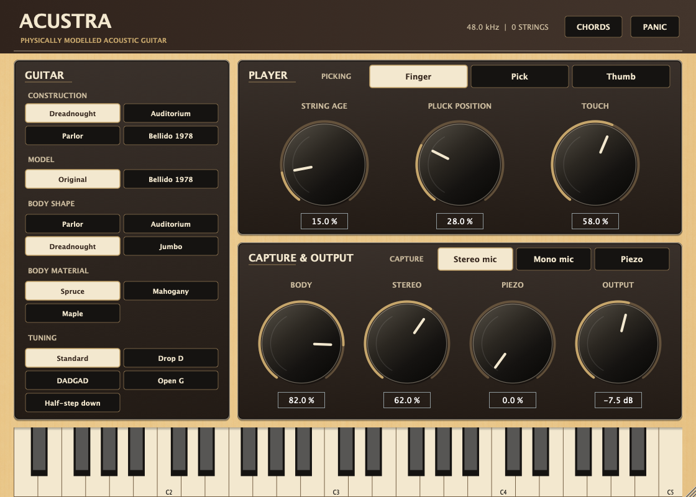

# Acustra

[](Docs/screenshots/acustra-standalone.png)

Acustra is an acoustic-guitar instrument for VST3, Audio Unit and Standalone
hosts. It synthesises every note in real time from six physical string models,
a passive measured bridge and a measurement-derived guitar body. The plug-in
contains no sample player and no recorded note audio.

Start with Guitar, Model, Picking and Capture: construction presets and one
additional measured guitar (Bellido 1978), finger/pick/thumb styles, and stereo mic, mono
mic or an under-saddle piezo through its onboard preamp, with the piezo also
available as a separate output. Shape and Material directions,
steel or nylon strings, String Age, Tuning, Pluck Position, Touch, Body Amount, Stereo Width
and Output remain directly accessible. Bridge-hand damping is a playing gesture
rather than a setting, so it arrives on CC2 and costs the panel nothing.
"Top of market"
remains the goal, not a validated claim; controlled listening against real
guitars and leading instruments is still required.

Shape, Material, Strings and Tuning use directly visible button groups;
the continuous sound controls remain knobs. The Picking tooltip names CC2 as
the bridge hand. Note-off always damps the note. Existing
saved sessions retain their parameter IDs. The revised picking styles and
stronger body variations intentionally change their sound. See the
[latest picking/body character comparison](Docs/control-character-feedback-2026-09-08.md)
and [realism work](Docs/realism-work.md) for measurements and limits.

## Audio demos

WAV files are omitted from this repository. Generate the eleven demos locally
with the commands in [Build](#build); the output goes into `Docs/audio/` and
is ignored by Git.

These PCM16 stereo WAVs are rendered deterministically by
[`Tools/RenderDemos.cpp`](Tools/RenderDemos.cpp) through the same JUCE-free
`AcustraEngine` used by the plug-in. Each file receives one whole-file peak
normalisation after rendering. There is no external post-EQ, compression,
reverb, room effect or recorded-note layer.

- **Steel sustain range** — isolated held
  notes from open E2 through B5.
- **Nylon fingerstyle** — two overlapping
  fingertip arpeggios.
- **Shape and material anchors** — the
  same chord at the Parlor/Jumbo and Cedar/Maple endpoints.
- **String age** — the same steel phrase with fresh
  and fully aged settings.
- **Alternate tunings** — Drop D, DADGAD and
  Open G partial chords.
- **Playing behaviours** — a chord change
  over a still-ringing chord, CC2 bridge-hand damping, then two natural
  harmonics above the fretted range.
- **Strummed chords** — chords sent on one
  sample swept as alternating strums, then one chord eight times hand-damped,
  no two strokes the same take.
- **Recuerdos de la Alhambra** —
  Tárrega's tremolo study, bars 1–12 on nylon: the thumb keeps an arpeggio
  while three fingers repeat one melody note on one string, ten strokes a
  second, each landing on a string the last stroke left ringing.
- **Lágrima** — Tárrega, bars 1–8 on the same
  guitar played slowly, where the sustain and the beating between coupled
  strings carry the piece rather than the attack.
- **Picking techniques** — identical notes
  and velocity with Finger, Pick and Thumb, first steel, then nylon.
- **Capture types** — the same steel performance
  through stereo mic, mono mic, then piezo. Native relative levels are
  retained: the piezo is level-matched to the microphones by loudness, and its
  sensitivity is anchored to a published level, not a measurement of hardware
  gain.

<!-- peaks-table-begin: regenerated by AcustraRenderDemos; edits between the markers are overwritten -->
| File | What it is | Length | Rendered peak | Normalisation |
| --- | --- | ---: | ---: | ---: |
| `01-steel-sustain-range.wav` | Steel sustain from open E2 to B5, one held pluck at a time | 9.5 s | −19.4 dBFS | +16.4 dB |
| `02-nylon-fingerstyle.wav` | A fingertip nylon arpeggio with overlapping held notes | 4.2 s | −15.7 dBFS | +12.7 dB |
| `03-shape-material-anchors.wav` | One chord: Parlor/Jumbo, then Cedar/Maple anchor settings | 13.7 s | −7.4 dBFS | +4.4 dB |
| `04-string-age.wav` | The same steel phrase with fresh strings, then fully aged strings | 6.5 s | −12.8 dBFS | +9.8 dB |
| `05-alternate-tunings.wav` | Drop D, DADGAD and Open G chords | 12.3 s | −11.3 dBFS | +8.3 dB |
| `06-playing-behaviours.wav` | A chord change over a ringing chord, CC2 bridge-hand damping, then two natural harmonics above the fretted range | 10.7 s | −11.6 dBFS | +8.6 dB |
| `08-strummed-chords.wav` | Same-sample chords swept as alternating strums, then one chord eight times hand-damped, no two strokes the same take | 6.9 s | −6.4 dBFS | +3.4 dB |
| `09-recuerdos-de-la-alhambra.wav` | Tarrega, Recuerdos de la Alhambra, bars 1-12: a nylon tremolo over a thumb arpeggio | 31.6 s | −18.3 dBFS | +15.3 dB |
| `10-lagrima.wav` | Tarrega, Lagrima, bars 1-8: a sung nylon melody over held bass | 26.0 s | −18.8 dBFS | +15.8 dB |
| `11-picking-techniques.wav` | Finger, pick and thumb on steel, then on nylon; same notes and velocity | 10.6 s | −16.7 dBFS | +13.7 dB |
| `12-capture-types.wav` | Stereo mic, mono mic, piezo | 7.3 s | −22.4 dBFS | +19.4 dB |
<!-- peaks-table-end -->

## Real dry-note benchmark

The physical fit is compared with 115 real, dry guitar-note recordings. The
frozen report separates 83 training examples, 24 development-validation
examples, and 8 independent flat-top examples; it measures attack, harmonics,
tuning, early pitch trajectory, decay rate, body spectrum, and dynamics. Lower
is better, but the absolute score depends on analysis settings, so only paired
comparisons over identical notes support a decision. In the frozen
2026-09-04 comparison, the fitted calibration changed the three scores by
−26.4%, −20.1%, and −13.3% against neutral calibration rendered with the same
engine and notes. These are engineering descriptors, not a listening
preference or a claim of perceptual equivalence. That dry-note comparison
predates the current force/moment body; its newer GuitarSet and AG-PT results
are reported separately below and in Known gaps.

The renderer also emits matched `*-sample-v1.json` manifests for the frozen
first-version sample player. Its scores are 1.2080, 1.4437 and 0.1286 on those
splits, but they are a pipeline control rather than a product win: that player
is replaying the same captured zones used as targets. The result measures its
attack envelope, interpolation and stereo playback path; it says nothing about
uncaptured notes, transitions or performances. Keeping this control beside the
physical result prevents the misleading claim that a source-recording replay
is an independent realism benchmark.

On the current engine - the force/moment body, the coupled-model shapes, the
continuous Gaussian contact, the steel contact transport and the Yamaha nylon
calibration, the two lines of development merged on 2026-09-24 - the same
protocol at the shipping calibration read 6.392396 on training, 6.378758 on
development validation and 9.256751 on the flat-top rows with the benchmark's
reference Original bridge, and 6.268767, 6.172187 and 8.591335 with the Fylde
bridge the steel presets then played; with the parallel polarisation radiating
(Pluck and strings) they read 6.167890, 6.042989 and 8.559757, and 6.148927,
6.008802 and 8.232583; with a steel pluck releasing most of its energy
parallel to the top and nylon's normal-led, 6.087514, 5.938380 and
8.120314, and 6.112127, 5.928819 and 7.948071; and with the three values a
blind listener chose that day (no polarisation end correction, a longer nylon
T60, steel's wider Dreadnought), 6.145552, 6.216121 and 7.618706, and
6.180182, 6.103707 and 7.572502; with a force-limited release, 6.131424,
6.217292 and 7.622994, and 6.182335, 6.097915 and 7.556267; with steel's
body resolved over 250 ms and nylon plucked at the soundhole's edge,
5.928457, 5.989914 and 7.492669, and 5.877624, 5.806595 and 7.328740; and
with the three values a blind listener chose on 2026-09-25 (the treble-bridge
and upper-bout microphone pair, a steel Finger 149 mm from the bridge,
steel's air mode four times stronger at the bridge microphone), the refitted
plectrum and double-precision bridge modes, 6.329200, 5.994260 and 7.425652,
and 6.432400, 5.996174 and 7.181437. The latter are the base every later
paired comparison was taken against until 2026-09-27. Under Pick the archtop
rows read 6.103277 and 5.702917. With the plectrum released as the string
slides round its edge and steel's plate modes damped to the anechoic
flamencas' measured Q (2026-09-27), the Fylde reading is 6.403167, 6.019245
and 7.121675, and under Pick with the Fylde bridge 5.943771 and 5.605528
(steel alone 5.516350 and 5.511048). With the pluck and bending loss chosen
by ear on 2026-09-28 the Fylde reads 6.4472, 6.0328 and 7.2714, and under Pick
6.0173 and 5.5799. On steel's own bridge, which the steel presets play since
that day, with the plate-Q rule down to 150 Hz, the readings are 6.4040,
6.0056 and 7.2752, and under Pick 6.0182 and 5.5377. These are the current
base. The renderer renders each material at its anchor body - steel the default
Dreadnought, nylon the Auditorium slot that is the measured classical.

The bank's steel rows are an archtop, and its only flat-top is eight notes
of one finger-plucked take. [`BenchmarkOpenCorpora.py`](Tools/BenchmarkOpenCorpora.py)
scores the same descriptors against open recordings outside the bank, each
prepared by a tool that pins its source hashes and licence and writes rows in
a shared schema (no audio is committed): 49 picked and 55 finger-plucked notes
from the two full CC0 Eastman E1D dreadnought takes
([`PrepareEastmanCorpus.py`](Tools/PrepareEastmanCorpus.py)), 11 regions of a
CC0 Martin HD28 sample bank whose samples start at the attack and stop at their
loop, so its attack term is not read
([`PrepareMartinCorpus.py`](Tools/PrepareMartinCorpus.py)), and 317 anechoic
nylon notes at pp, mf and ff from the University of Iowa's Raimundo 118,
high-passed at 60 Hz against the microphone's rumble and tuned 22 cents flat,
which its tuning term reads as error
([`PrepareIowaGuitarCorpus.py`](Tools/PrepareIowaGuitarCorpus.py)). Its
renderer is the fit renderer's model half, byte-identical to it. On the
current engine (steel on its own bridge, 2026-09-28) they read 6.3767 (Eastman
picked), 6.8426 (Eastman finger), 7.0770 (Martin HD28) and 9.8673 (Iowa
nylon). None of them is fitted; a
split used to choose a calibration stops being a held-out reading. Two of the
bank's eight flat-top targets (E2, E3) start after their attack has begun,
which the corpus tool's onset rule catches and the bank's export did not.

Run `python3 Tools/SummarizePhysicalBenchmark.py` to print the compact split
table, historical sample-player control and five retained realism paths from
the committed
[`physical-fit-report.json`](Docs/physical-fit-report.json). The full renderer
and scoring protocol remain in [`PhysicalFitRenderer.cpp`](Tools/PhysicalFitRenderer.cpp)
and [`FitPhysicalModel.py`](Tools/FitPhysicalModel.py).

For a new engine build, `FitPhysicalModel.py candidate.json --compare baseline.json`
checks target audio SHA-256 hashes, note identities, dynamics groups and analysis
settings before reporting paired changes by descriptor and string material.
Render manifests record the actual calibration vector and controls; model-only
re-renders update that vector. Microphone targets do not establish pickup
realism, and this corpus does not identify pick and thumb technique separately.

A separate [GuitarSet](https://zenodo.org/records/3371780) performance audit
compares 72 seconds of real microphone audio with string-aware renders of
315 annotated notes: six players, three comping and three solo takes of the
same phrase. Velocity is fixed at MIDI 91 because the annotations contain no
measured note dynamics. The first baseline averages 14.88 dB of multiscale log
spectral error, 0.903 spectral convergence and 0.312 chroma cosine distance.
These expose substantial remaining mismatch. The recording uses a different
body, microphone and room, and GuitarSet timing statistics previously informed
the engine, so this is not an untouched holdout or a perceptual ranking.
Signed octave-band diagnostics locate that mismatch: after whole-clip RMS
matching, the baseline averages 16.2 dB less energy at 80–160 Hz and 9.5 dB
less at 2560–5120 Hz, with excess energy in the intervening low-mid bands.
These are spectral differences on these recordings, not additional score terms.

[`BenchmarkPerformances.py`](Tools/BenchmarkPerformances.py) fixes the six
excerpts before scoring, verifies the published archive checksums, preserves
annotated timing and quiet frames, and exports paired WAVs matched by whole-clip
RMS. Its report retains input, executable and scorer hashes, individual metrics
and listening trims. The committed report's `performance_benchmark_2026_09_05`
entry retains this baseline without distributing the source recordings.
The adjacent `performance_spectral_diagnostic_2026_09_05` entry uses exactly
the same audio bytes and leaves all three baseline distances unchanged.

The measured Fylde bridge gives the following paired results with identical
recordings, calibration and macOS arm64 build. Lower descriptor distances mean
closer to these recordings; they are not perceptual ratings. All nylon renders
remain byte-identical. Repeated on the current force/moment body (Linux x64,
2026-09-10) the pairing reads 6.440350 → 6.321691 on training (−1.8%),
6.521658 → 6.301160 on development validation (−3.4%) and 9.260870 → 8.603331
on the flat-top rows (−7.1%), with the steel rows alone −2.9% and −5.9%; the
decay term carries most of it (5.343 → 4.933, 4.980 → 4.553, 6.806 → 5.234),
and only the pitch-trajectory term moves the other way. On the merged engine
(2026-09-24, macOS arm64) the same pairing reads 6.392396 → 6.268767 on
training (−1.9%), 6.378758 → 6.172187 on development validation (−3.2%) and
9.256751 → 8.591335 on the flat-top rows (−7.2%), the steel rows alone −3.0%
and −5.5%. This is why the steel presets now play it.

| Comparison | Original bridge | Fylde bridge |
| --- | ---: | ---: |
| Dry training loss, 83 notes | 6.113884 | 5.958960 |
| Dry development loss, 24 notes | 6.074618 | 5.741121 |
| Dry flat-top loss, 8 notes | 8.076845 | 7.434877 |
| Performance log spectral error, dB | 14.875729 | 14.903526 |
| Performance spectral convergence | 0.903121 | 0.848586 |
| Performance chroma distance | 0.311951 | 0.244766 |

The performance log error rises slightly while the other descriptors improve.
The report's `measured_steel_bridge_2026_09_05` entry retains the individual
results, provenance and exact input/model hashes.

A historical audit of the now-retired magnetic model used the same six
performances, which have simultaneous magnetic recordings: a mono
mix of six Ubertar single-coil pickups on nickel-wound steel strings. Against
that reference, the Original bridge's magnetic output scores 17.591981 dB log
error, 0.788438 spectral convergence and 0.268841 chroma distance. The Fylde
bridge changes these to 17.433659, 0.805354 and 0.263927, respectively. After
RMS matching, Original averages 3.95 dB less energy at 80–160 Hz and 12.44 dB
more at 5120–10000 Hz. This identifies a substantial remaining pickup mismatch.
Cross-capture controls disagree too: the microphone model has lower log error
against the pickup recording, while the retired magnetic model has lower spectral
convergence. These descriptors therefore cannot rank pickup realism by
themselves. The committed `magnetic_performance_benchmark_2026_09_05` entry
retains both bridges, the four microphone/pickup pairings and source hashes;
no parameters were fitted to these results. Coil position, field response,
loaded electronics and per-string gains are undocumented in GuitarSet.

An independent exploratory audit adds 344 recordings from Mohammed Alkooheji's
[Acoustic Guitar Notes v3](https://www.kaggle.com/datasets/mohammedalkooheji/guitar-notes-dataset):
a Walden G551E on steel and Yamaha CM-40 on nylon. Before inspecting audio,
the tool selects two recordings at every pitch from D2 to G♯5 for each material
and the pick/finger labels. The author warns that technique labels vary and
combines finger with thumb; capture, velocity and fingering are undocumented.
No parameters are fitted to this corpus. On steel, Original → Fylde changes
attack-band MAE from 9.63 → 8.87 dB, harmonic-level MAE from 9.16 → 8.78 dB and
tuning MAE from 7.88 → 7.69 cents, while pitch-trajectory MAE worsens from
1.41 → 1.56 cents. These comparisons use identical available elements.
Missing model decay measurements fall from 22 to 2 of 2662 target elements;
the resulting decay MAEs have different coverage and cannot establish a paired
improvement or regression. All 86 nylon renders remain identical. The report's
`independent_technique_note_audit_2026_09_05` entry retains every recording's
descriptors, availability counts and source/model hashes; these are descriptive
results on another guitar, not controlled technique validation or a realism rank.

The [AG-PT-set](https://zenodo.org/records/10159492) hammer-on audit adds a
Taylor 114CE recorded through its LR Baggs Anthem system. Its hammer-on files
have technique labels but no authored event times. The fixed first ten seconds
of the piano and forte high-E recordings contain 11 and 14 confidently inferred
upward semitone pairs when lag correlation agrees with a harmonic-aware FFT
estimate. Trimmed plateau RMS falls by a median 4.64 and 6.27 dB respectively.
These are recorded level ratios, not finger velocities or injected energy.
Requiring agreement with only the strongest FFT peak keeps just five forte
pairs and changes that median to 4.10 dB; detector selection matters.
[`BenchmarkHammerOnNotes.py`](Tools/BenchmarkHammerOnNotes.py) verifies the
published file hashes and retains both masks, exact measurement windows and
rejected candidates. No piano/forte-to-MIDI mapping is assumed.

An accompanying engine audit compares those same 25 inferred pairs before
and after the fretting-state correction, across 18 declared timing/velocity
assumptions and two captures (1,800 renders). Each assumption set reduces the
piezo's median absolute level-ratio difference by 0.71–2.32 dB; microphone
changes range from a 1.08 dB reduction to a 0.63 dB increase. These are
conditional comparisons: the recording's blended pickup, actual finger motion
and event times are unknown. No best setting is selected or fitted. The
`agpt_hammer_plateau_audit_2026_09_05` report entry retains the protocol,
per-setting results and source hashes.

Repeating the unchanged protocol for the subsequent action-geometry correction
increases median absolute level-ratio error in 17 of 18 microphone assumptions
and all 18 piezo assumptions. Across assumptions the change ranges from
−0.004 to +0.828 dB for microphone and +0.026 to +0.274 dB for piezo. All
900 pre-hammer prefixes remain identical. Correct fret coordinates therefore
do not establish better agreement with these recorded hammer-on levels; the
unmeasured velocity map remains a separate problem. Legato, and with it the
engine's hammer-on, was removed on 2026-09-28 at the user's request, so these
engine comparisons are history; the recording audit stands on its own.

A private listening reference compares both Acustra bridges with the installed
NI Strummed Acoustic 1.1.0 library in Kontakt 7.10.6: four bars of C major at
120 BPM, eighth-note strums, stereo capture, and EQ, compression, reverb and
doubling disabled. Ten-second auditions share the same crop and match whole-file
stereo RMS to −24 dBFS. NI chooses recorded voicings, accents and microtiming;
Acustra receives explicit open-C note events. This matches harmony and nominal
rhythm, not identical performances, and establishes no product ranking.
The report's `commercial_listening_reference_2026_09_05` entry preserves the
protocol, state/input/audio hashes and repeatability evidence. Commercial audio
and opaque plugin states remain private; reproduction needs the installed library.

## How it works

Acustra is two layers, and only the outer one knows a host. The instrument is
JUCE-free C++17 under `Source/DSP/`: `AcustraEngine` is the physical model,
and `AcustraPerformer` is the player in front of it. The player splits each
block at its events and turns MIDI into engine calls - channels, the MPE lower
zone and its controller scope, RPN bend ranges, CC1/2/64/74 (CC68 is ignored; see below), channel
pressure and the string-per-channel mode, same-sample chord grouping and
strums, and the Gather Chords window with the latency it costs. The plug-in's
processor is a thin JUCE adapter around it (parameters, saved state, editor,
bus layout) that decides nothing about how a note is played. A front end
without MIDI, such as the Reason Rack Extension, spells its notes and
controllers as the same MIDI messages at their sample offsets, so every front
end plays one behaviour rather than a port of it.

### Six-string performance model

MIDI first selects one of six guitar strings. Each string covers its open note
plus twenty frets. The allocator replucks a note on the string still sounding
it once its key is up, as a guitarist does; before that rule a repeated E4
hopped across five strings, one per repeat, and left every one of them
ringing. It preserves duplicate-note ownership and never takes a string whose
key is still down while another string can sound the note.

Beyond that it places notes with a fretting hand, the rule the listener set:
"imagine a player's hand on the frets that are currently playing or were
playing previously - try to fit a fret that a finger would reach. then,
prefer empty strings, then prefer lower frets." Each string remembers the
last fretted note it sounded. Held notes, key or pedal, place the hand with
weight 1; released ones with exp(-age / 1 s), and not at all after 2 s. A
hand in position covers four frets, the highest at most three above the
lowest, and reaches a fifth by stretching: the small and large finger spans
of [Heijink and Meulenbroek, J. Motor Behavior 34(4), 2002](https://www.socsci.ru.nl/meulenbroek/Publications/Heijink%20en%20Meulenbroek%202002.pdf),
where the five-fret span was rated harder and six professional guitarists,
fingering note sequences themselves, moved the hand in 2 of 31 fingerings and
then by one fret. A candidate string and fret costs nothing when the hand
reaches it where it is, half a fret for each fret held outside the four-fret
position, and each remembered finger's weight per fret the hand would have to
move; notes the hand must hold that no hand spans are impossible. The
allocator takes the cheapest, then an open string, then the lower fret, then
a silent string before a ringing one. With nothing fretted held or released
in the last two seconds (a fresh engine, or a rest as long as the one after
which a strum restarts on a downstroke) the hand is forgotten, and a note is
placed exactly as before the hand existed: the free string with the lowest
fret, else the string released longest ago, else the oldest. That keeps every
single-note benchmark render bit-identical. String-per-channel controllers
and MPE member channels keep their own strings and the handless allocator.

Standard, Drop D, DADGAD, Open G and half-step-down tunings change those six
physical constraints rather than transposing the final mix.

Alternate steel tunings retain each string's standard linear mass and derive
the new tension from its tuned open frequency. Drop D therefore loosens the
same low-E string instead of silently substituting a heavier string at standard
tension.

Above the twentieth fret the instrument still reaches, through the natural
harmonics of its open strings. A note there is played as a light touch at a
node if some string has an integer multiple of its open pitch within 25 cents,
and stays silent otherwise, so the requested pitch alone decides and no
keyswitch is offered: the seventh harmonic is 31 cents flat and is excluded by
the same tolerance that admits the second through sixth and the eighth. The
touch is the exact node-mode projection — the released shape averaged over its
n cyclic shifts, which passes every multiple of n at unit gain and cancels
everything else — so the surviving modes keep precisely the amplitude the pluck
gave them, and a harmonic comes out quieter than the stopped note rather than
louder.

There is no legato mode. CC68, MIDI's Legato Footswitch, used to switch the
fretting hand to hammer-ons and pull-offs; at the user's request (2026-09-28,
[decisions](Docs/decisions.md)) legato was removed everywhere, from the
engine, the shared player and both front ends, and CC68 is now ignored. Every
note is plucked, and notes that arrive together are voiced and strummed as a
chord whatever CC68 says.

CC2 is continuous bridge-hand pressure: the heel of the picking hand resting
by the saddle, a soft lossy absorber whose loss rate adds to the string's own,
darkening the note as it shortens it. It is a playing gesture rather than a
construction setting, so it stays a controller and the panel keeps its ten
controls; a pressure of zero is an exact no-op, proven by 71 bit-identical
corpus renders.

Note-off damps a fretted note over 160 ms and an open note over 1.25 seconds,
and that loss is a gain per round trip: the loop slews the gain it applies
toward the requested one across one round trip, in either direction, because
applying the whole of it to the first sample after the key came up stepped the
wave the junction reads by up to a third on a low fretted note, and the bridge
and body rang on that step as a thump 4.6 to 8.6 dB above the note's own level
at that moment. Paired held/released renders guard against a new attack at
44.1, 48 and 96 kHz. The comparison includes the held note at the same time:
its evolving envelope can exceed the preceding window's peak, and damping
can also change the interference between modes. These peak checks are not
a proof of physical energy conservation.

Note-off damps the note at every release velocity, including 127, without
retuning it or adding a new excitation, so a fast keyboard key-up never sounds
like another stroke. Release velocity is read by nothing.

A chord that arrives on one sample, which is what a sequencer sends and no
hand can play, is swept as a strum: newly assigned strings are fretted at
that sample, and each is released when the pick reaches it. An already held
note keeps its preceding vibration until its scheduled re-pluck. The k-th string
sounds k string-spacings later at the pick's speed, low to high on a downstroke and
back on the return, so consecutive strums alternate, and a rest of more than
two seconds restarts with a downstroke. The spacing is the set-up dimension
at the saddle; the pick's speed is a player's map of velocity over the
0.51–2.46 m/s range measured from GuitarSet strokes. The corpus does not
establish that velocity-to-speed relationship. Chords whose notes arrive
spread in time are played as sent, unless Gather Chords is on.

Notes that land on one sample and one channel are fretted as one shape
(AcustraEngine::planChord, which the plug-in calls before sounding them):
every way of putting them one to a string is scored by the hand's rules, a
shape that takes no held string, fits one hand and is reached from where the
hand is with the fewest frets moved, re-strikes a still-ringing note where it
rings, and has the most open strings and the lowest frets. E major, A minor,
G, C and D land in their first-position open shapes; C4-E4-G4 on its own
becomes G fret 5, B fret 8 and open E.

A chord played live reaches the plug-in one key at a time, in whatever order
the fingers land, and each note used to take the free string with the lowest
fret before the next was known. Played low to high, C4-E4-G4 became G fret
12, B fret 1 and open E, an 11-fret stretch no hand makes, and a note high on
a wound string does not sound like the same note on a plain one. The hand now
refrets a chord still forming: when a note arrives within 30 ms of the one
before it on its channel and would otherwise take a held string or leave the
hand an impossible stretch, the chord so far is refretted with it as one
shape, moving as few of its notes as the shape allows. A moved note is
replucked on its new string, inside the chord's own onset spread, and the
string it leaves is taken by another note of the shape or damped by the
leaving finger. The same C4-E4-G4 rolled over 20 ms becomes G fret 5, B fret
8 and open E, with C4 plucked twice, 20 ms apart. Gather Chords, the CHORDS
switch beside PANIC, avoids that second pluck at the cost of latency: it
holds every MIDI event back by 30 ms.
A Note On that comes due takes along the Note Ons its channel received in the
30 ms after it, and the group reaches the allocator as one wrist event:
fretted as one shape and strummed exactly as the same chord sent on one
sample. Thirty
milliseconds is where one chord ends and notes meant apart begin. A pianist's
louder melody note strikes 20 to 30 ms before the rest of its chord, mostly
because a faster key travels sooner, which a keyboard's key-bottom contact
shares, while asynchronies played on purpose usually exceed 30 ms
([Goebl, JASA 110(1), 2001](https://iwk.mdw.ac.at/goebl/papers/Goebl_JASA2001_melodyLead.pdf)).
The cost is 30 ms of latency on every note, which the plug-in reports so a
host compensates it on playback; a player hears it live. The switch is off by
default. A key repeated inside the window, or a controller that changes how
notes are allocated (sound or notes off, reset, mono/poly, the RPNs that lay
out an MPE zone), ends a chord. String-per-channel controllers already say how
each note is played, so they are only delayed.

And no two plucks land in the same place: each draws its own point within ±0.02
of the string length, the take-to-take spread the reference recordings'
round robins show, which is what makes a repeated stroke a new take rather
than a copy.

Taking a still-sounding string for a new pluck preserves its preceding
waves, in both planes, in separately damped loops; the parallel plane holds
most of a pluck and reaches the body through the rocking saddle, so dropping
it at a repluck, as the build before this did, cut a nylon E3's old wave
off 24 dB under the new note's first 30 ms instead of letting it die under the
hand. This is a provisional transition model. [Laurson et al., CMJ 25(3), 2001](https://aaltodoc.aalto.fi/bitstreams/768dbe9c-526c-414a-b2ce-0742574b8064/download)
reduce loop gain over about 10 ms **before** the next pluck;
[Erkut et al., AES preprint 5114, §3.2](https://aaltodoc.aalto.fi/server/api/core/bitstreams/a290c5f2-9a62-4d17-ba32-160615a9c670/content)
measure a 20–60 ms finger-contact interval. Neither establishes the current
model's 10 ms post-release T60 or its two concurrent wave states. The retained
loop's stored-state energy falls below 1% in the existing 60 ms regression,
but the moving bridge keeps driving it: its active lifetime can last seconds.
Each independently returned wave therefore contributes its own impedance to
the junction - the parallel one at (h/a)^2 of it on the rocking - with the
old wave retaining the impedance it had at capture.
The six physical saddle-to-anchor springs are still counted once each.
Measured on a chord change 0.6 seconds after the first chord, the strings
still hold 25% of their initial energy and an earlier build discarded all of
it. A held note
replucked goes through the same hand: projecting its stored shape onto the
modes with a node at the pluck point in one sample, as the build before this
did, clicked into the limiter and let the near-node modes pile up pluck after
pluck, a held G2 replucked six times at 250 ms peaking 15 dB above its first
pluck where it now peaks 3 dB above it with nothing on the first samples.
The sustain pedal defers the hand's damping until pedal-up. A channel's pitch
bend is a slide — the fretting hand moving along the neck, so the sounding
length changes and the tension does not — and it changes the active string
length without replaying the pluck. An MPE member channel's own bend is a
different gesture: one finger pushing a single stopped string across the
fret at the length the fret fixes, so it goes through the string's tension by
Grimes' law (PLoS ONE 9(7):e102088, 2014, Eq. 6), which moves the
inharmonicity (bending stiffness B goes as 1/T) and the bridge-junction
impedance the string presents (Z = sqrt(T·mu)). The port is followed sample
by sample, because the junction sums all six strings' impedances every
sample; measured against Grimes over a 0-200-cent bend on four steel strings,
pitch error is 0.0002 cents and the twelfth partial's stretch moves within
0.15 cents of what the bent tension predicts. The MPE manager's zone-wide
bend stays a slide. Nylon's three wound basses have no measured axial
stiffness and keep the length (slide) convention for a member bend too.

CC1, the modulation wheel, is the fretting hand's vibrato: an axial tension
modulation at fixed length (Grimes Sec. 0.3; Erkut, Valimaki, Karjalainen and
Laurson, AES 108th Convention, Paris, Feb 2000, preprint 5114, Sec. 3.3), so
the same tension route that carries a member bend also carries the vibrato,
moving the sounding pitch, the inharmonicity and the junction port together —
an earlier build moved only the last two and left the fundamental fixed,
which review caught. It is one-sided upward from the note's own pitch,
converges over a 0.5 s onset, and runs from Erkut's measured 4.9 Hz
fast-and-shallow to his 1.4 Hz slow-and-deep as the wheel opens; full-wheel
depth is an authored 20 cents (no source gives guitar vibrato depth in
cents), measured in the rendered pitch at 20.0 to 20.1 cents and never
falling below the note's own pitch by more than 0.06 cents. An open string
gets none, since no finger is stopping it. Like CC2 it is one gesture across
the instrument, not per channel.

Conventional MIDI is the default: all sixteen channels are independent and
channel 1 is not implicitly global. A lower MPE zone is created only by RPN 6
on channel 1. Channel 1 then manages the contiguous member channels above it;
its bend and sustain are global to that zone, while bend and sustain remain
scoped to each member channel. RPN 0 sets 0--96-semitone bend sensitivity, with
MPE defaults of 2 semitones for the manager and 48 for members. A released MPE
tail freezes its member bend so reuse of that member channel cannot retune the
old string, while subsequent manager bend remains live. MPE Timbre (CC74) sets
a member channel's own pluck point for the note it carries, after Traube and
Smith's plucking-point estimation (Proc. COST G-6 DAFx-00, Verona, Dec 2000,
153-158), and moves only that voice's own comb nulls; MPE channel pressure
biases that channel's vibrato depth down toward half its unbiased value (never
above the wheel's own ceiling) and does nothing else. An opt-in string-per-channel mode — MIDI
1.0's own Mono Mode On (CC126, value = string count) / Poly Mode On (CC127)
on the basic channel, the standard spelling of a one-string-per-channel
layout such as a hexaphonic pickup or a guitar-to-MIDI converter might send —
puts each of the six channels onto its own string, bypassing the allocator;
no control-surface driver on hand is confirmed to transmit CC126 itself, so
today the mode is reachable through a MIDI editor or a host's own CC tools.
Upper-zone MPE is not implemented.

### Pluck and strings

Each audible string path is a full-round-trip stiff-string waveguide. A note
begins with a triangular travelling-wave history. A continuous Gaussian
contact profile rounds that shape at the existing aperture's RMS width. It
removes the former five-point profile's repeated high-frequency unity lobes;
the signed result preserves the linear smoothing without rectification adding
extra harmonics. The profile is a numerical contact assumption, not a measured
finger shape; [its qualification](Docs/contact-kernel-and-power-2026-09-08.md)
records the small, mixed improvement against real guitar recordings. Its current phase origin and initially
empty filter/body histories do not describe a complete release from rest.
A short deterministic noise burst adds the
release detail; the bridge-local direct path's fitted gain is zero, so the
measured body is the only radiator. On steel the burst's level (2.21 of the
authored law), the contact's width (0.49 of its reference) and the velocity
brightness (1.106) were chosen by ear with the strings' bending loss below
(Docs/decisions.md, 2026-09-28): 70% of the way from the joint refit's
optimum (0.38, 0.81, 1.073) toward the pluck refitted around half the loss
the recordings measure (3.0 on its ceiling, 0.35 on its floor, 1.120). Nylon's
velocity brightness is 0.15, the value both of those fits gave it. Pluck Position moves the
displacement point; Touch and MIDI velocity alter its aperture, level and
brightness. The hand lets the string go at the force it can hold, not at a
set displacement: a point force at distance a from the bridge deflects a
string of tension T and speaking length L by F·a(L − a)/(T·L), so the same
stroke displaces a stopped string less than the open one the velocity law is
calibrated on, by (L − a)/L against (L0 − a)/L0 at the same hand position (up
to 2.7 dB less at the 17th fret), and its attack-pitch glide shrinks with it;
the contact noise stays on the force. A blind listener chose this on every
up-the-neck pair (Docs/decisions.md); the benchmark is neutral on it
(training +0.07%, development validation −0.07%, flat-top −0.24%) while its
pitch-trajectory term improves on every split. A fitted register law broadens the effective low-note contact and
narrows it in the upper register, correcting a repeatable corpus-wide spectral
slope without applying note-dependent body EQ. The fitted exponent continues
past the pitch-independent point, so low-note contact is broader and high-note
contact narrower than in the earlier model.

A string does not leave a plectrum's tip from rest. Under Pick the released
state carries, beside that displacement, a velocity over the same contact
width — the string the tip was carrying when it slipped off — written as
Smith's equal integrated waves and so unfolding to a hump of velocity with no
displacement of its own. Its kinetic energy is a fitted share of the
displacement's, `share(v) = pickReleaseVelocityShare · v^pickReleaseVelocityExponent`
for MIDI velocity v in 0–1, and the pick's contact transient is an impact:
broadband, and growing with the tip's speed (`v^(exponent/2)`, the same speed
law) rather than with the note it starts, scaled by `pickTransientGain`. All
three are fitted on the picked archtop recordings across their four velocity
layers and read by the Pick technique only; Finger and Thumb, and so the
finger-plucked flat-top and classical rows, are bit-identical. The first fit
(share 1.0 at full velocity growing as v^2.93, transient 0.078 of the Finger
burst) belonged to a Pick with the wider 0.5 contact and the five-point
kernel; the merged Pick meets the string narrower (0.35 of the Finger width),
more bridgeward (0.40 of its distance) and through the continuous Gaussian,
and the same stage refitted from that vector wants 0.3125·v^0.93 and a 0.125
transient (archtop training under Pick 6.623494 → 6.546029, development
validation 6.271127 → 6.256259). Once a pluck released most of its energy
parallel to the top (below), the same stage refitted again wants only a
small, nearly flat share, 0.0625·v^0.47, and the transient gain on its zero
bound, which is the Finger burst law (archtop training under Pick 6.334019 →
6.284861, development validation 5.941904 → 5.904206). With the strings'
bending loss the share returns: since 2026-09-28 it is 0.582·v^0.859, chosen
by ear 70% of the way from the joint refit's 0.008·v^0.49 toward the
0.83·v^1.02 the plectrum was refitted to around half the measured loss, whose
pick the listener heard as too intense (Docs/decisions.md); the transient gain
stays at zero. The velocity hump is smoothed by that same
Gaussian contact as the displacement, exactly: the rest wave gains the
tabulated corner function at its two folded apex corners and the velocity box
is the difference of two Gaussian edges. The velocity's
partials fall 6 dB/octave slower than the displacement's, which is the tilt the
recordings gain with dynamics: before the mechanism the model's loud layer
(MIDI 112) carried 5–9 dB too much H1–H3 and 4–6 dB too little H7–H10 while its
soft layer (MIDI 16) sat within a few dB, and its first 12 ms were 10–19 dB
short above 4 kHz at the loud layer only. Two things are fixed by measurement
rather than fitted. The written frame: the plucked shape every calibration was
fitted with is the rest state advanced by half the apex phase and negated
(partial magnitudes agree to 0.001 dB, phases differ by exactly −πpn), and a
rest-frame pluck with the *same* magnitudes moved the archtop harmonics term
from 8.61 to 12.77, because the idle strings, bridge and body at coinciding
partials interfere with the string according to the phase it starts with — so
both components are written in the fitted frame, where they stay in
quadrature. And the energy: the fitted level law describes the displacement,
and the velocity is energy on top of it; redistributing one fitted energy
between the two read worse on both splits, since the hump's energy sits in
partials that decay fast and the sustained level then rose too little with
velocity. What the plectrum still lacks is any measurement of its own: the
share and exponent are fitted, not a beam and friction solver, and the
archtop's four layers are the only picked recordings in the bank.

Nor does the string leave the tip at an instant. It slides round the
tip's rounded edge, and while it does the held force F0 falls away; the
pluck point answers at once with a velocity dF/(2Z), so, linearising the
edge's hold, the force unloads as e^(t/tau) with tau = r/u,
u = (c/2) y0 (1/a + 1/(L - a)) the speed an instantly released pluck point
starts with. Every partial is multiplied by 1/(1 - j omega tau), a
first-order low-pass whose corner rises with the force the tip held: a soft
stroke is let go slowly and dark, a hard one fast and bright. The radius r
was first fitted at 0.15 mm on the picked archtop training rows (the
pick-release stage, refitted around it, then wanted the release-velocity
share and the pick burst at zero), moving Pick only: archtop training under
Pick 5.9391 -> 5.5639, development validation 5.5588 -> 5.4839, the frozen
test split 5.6678 -> 5.4272, the Eastman's picked rows 6.6596 -> 6.5254
(Docs/decisions.md). It ships at 0.116 mm, chosen by ear with the bending
loss on 2026-09-28: 70% of the way from the joint refit's 0.122 mm toward the
0.114 mm refitted around half the measured loss.

Transverse motion stretches the string, and the tension that adds can also be
represented as a longitudinal wave with the string's own axial
resonances, at `c_long/2L` with `c_long = sqrt(EA/mu)`. For this steel set that
is 1.5 to 3.9 kHz and for plain nylon 1.18 kHz, both computed from the same
construction data the transverse model uses, with the wound steel basses taking
their axial area from the published core diameter. The first and third
fixed-fixed axial modes per string can be driven by DAFx-26's `EA/(2L)` times the
mean square slope, through the same
displacement scale the attack-pitch surrogate is calibrated with. That path is
kept at zero in the shipping calibration: without a measured radiation level,
its narrow onset sounds like a pitched water drop rather than a string pluck.
Because the drive is a square it carries the products of the transverse
partials, so what
the resonators pass are sum and difference phantom partials rather than an
added tone, and it grows faster than the note that made it: 4.3 dB of extra
1.5--4 kHz energy at a quarter velocity against 11.1 dB near full. It radiates
one-way, outside the junction. Nylon's three wound basses are left out of it:
their published density is an effective composite figure that is right for
transverse mass and wrong for axial stiffness, so nothing here fixes their
longitudinal speed.

Steel and nylon use separate scale, diameter, tension or density, and Young's
modulus data. The loop reads its fractional delay through a second-order
Thiran allpass held inside a fixed fractional band (Laakso, Valimaki,
Karjalainen and Laine, IEEE Signal Processing Magazine 13(1), 1996, 30-60,
Eq. 86), not an interpolated read: an allpass has magnitude exactly one at
every frequency, where the read it replaced lost up to 0.7 dB per round trip
at a half-sample fraction, so a string's upper partials used to decay at a
rate set by the accidental fraction of its loop length (a 47:1 range in loss
per round trip across nine notes); it is now a smooth 1.8:1 rise with the
partial's own frequency, and no note's H8 partial varies by more than 13%
across 44.1, 48 and 96 kHz. Frequency-dependent losses make upper partials
decay faster, and a second-order allpass follows the stiff-string
inharmonicity law, collocated at H1, H7 and H11.5 and re-solved at the tap the
delay currently occupies so a bend or vibrato's slewing fractional part does
not stall the solve. String Age lowers the high-frequency cutoff and
increases loss. A shared fitted cutoff scale of 2.286 reduces excess
upper-partial damping found across both materials; a regression proves that it
does not move the requested fundamental T60 or compensated pitch. Each string
can also lose its upper partials through its own bending stiffness, the
viscoelastic term of Valette's string damping model (*Mechanics of Musical
Instruments*, Springer 1995) and the bending-loss term of Woodhouse's (Acta
Acustica 90 (2004) 928-944): a stiffness EI(1 + i eta) loses
1/Q_n = eta B n^2 / (1 + B n^2), with B the inharmonicity the dispersion
uses, so the added decay grows as the cube of frequency. Both polarisations
carry it as a unit-DC two-pole section designed at the host rate, with its
phase in the tuning and dispersion collocation and its H1 magnitude in the
loop gain. A factor of zero is an exact no-op. The recordings' 20-300 ms
upper-partial decay measures steel wound 0.10 and plain 0.006; the benchmark
refuses that even with the pluck refitted around it, and its joint optimum
over Finger and Pick keeps wound 0 and plain 0.00078. What ships was chosen
by ear on 2026-09-28 (Docs/decisions.md): steel wound 0.035 and plain
0.0023, 70% of the way from that optimum toward half the measured loss (0.05,
0.003), with the pluck moved the same way (above), and nylon wound 0.029
(its own fit; its recordings read 0.03) and plain 0. What the benchmark
says of it is in Known gaps. A second,
orthogonal polarisation loop can be detuned from the first by an end
correction at the string terminations: Woodhouse (Acta Acustica 90 (2004)
945-965, Sec. 4.3) measured the polarisation parallel to the soundboard as
about 0.8 mm longer, in 650 mm, than the perpendicular one, on an open
string, and calls the exact size tentative ("would require detailed
computation"). Carried as a fixed length it splits a stopped string's planes
further the higher it is fretted (4.8 cents at the 14th fret, 6.8 at the
20th), and once the parallel plane radiated and held most of a steel pluck,
high notes drifted flat as that member took over, where the recordings' do
not. A blind listener preferred the steady pitch on every high-fret pair, so
the correction ships at zero, chosen by ear, over the published length the
benchmark mildly prefers (Docs/decisions.md); the mechanism stays
calibratable up to one string diameter. On steel this second loop
contributes slope energy to the attack-pitch surrogate below.

The parallel loop reaches the body too. A string vibrating parallel to the
soundboard pushes the saddle crown sideways at the crown's height over the
top, and a sideways force there is a moment about the string's own axis - the
rocking the archive's two bridge-end impacts measure. In the model's
normalized rocking coordinate `r = a*theta` that moment is `h/a` times the
horizontal force and the crown moves `h/a` times the rocking, so the parallel
polarisation's port is `(h/a)^2` times the measured rocking mobility, the
anchor stubs hold it with `(h/a)^2` of their stiffness, and its load reaches
the microphones through the measured moment-to-pressure paths. `h` is the
published height of the strings over the top at the bridge, to their lower
bound (R. Mores, *List of guitars measured*, 2021, HSaT): 8.1 mm on g21, whose
radiation steel plays with either bridge, 10.2 mm on g34 and 8.6 mm on the
1978 Bellido; `a` is the 23.2 mm impact half-spacing the saddle lever arms
already assume. Nothing is fitted. The Fylde bridge was measured without
rocking, so there the crown does not move and the parallel loop still
reflects rigidly, but its force still reaches g21's measured moment paths.
Both polarisations are one string: the normal
loop is tuned so that, loaded by the bridge, it sounds the requested pitch,
and the parallel loop shares that bare length (plus any end correction, zero
as shipped), so the pair's split - the doublet each partial beats with - is
the bridge's own pull on the normal member and varies note to note (0 to
about 10 cents here, 5 to 9 in Woodhouse's measurements). Where the saddle rocks, the two loops are
coupled through it and ring as one pair of modes; its sustained,
energy-weighted centre is found from the eigenvalues of the loops' round trip
times the saddle's 2x2 reflection, and both loops are lengthened by what it
sits above the request - the flamenca bridge's open B, whose parallel-led mode
sustains while its bridge-led partner sheds 0.24 dB a period, would otherwise
sound 6.6 cents sharp.

How a pluck divides between the planes follows the hand. On steel, a
finger's free stroke and a pick both cross the strings moving along the top
and press in only partly, so most of a steel pluck's energy is released
parallel to the top: the normal-plane share is 0.30 - 0.08 Touch (0.25 at the
default Touch, a release about 60 degrees from the normal), bounded to
0.17-0.35. That share was selected on the benchmark once both planes
radiated: from the 0.86 that had kept the one radiating plane audible, every
steel split improves - Fylde bridge training -0.39%, development validation
-2.38%, flat-top -3.46%, Original bridge -1.10%, -2.78% and -5.13% - and a
blind listener preferred it on both steel pairs. Nylon keeps the normal-led
0.91 - 0.08 Touch (0.86), bounded to 0.78-0.96. The same move split the
classical rows (training +0.54%, development validation -2.4%), and the
listener preferred the normal-led pluck on all three nylon pairs and again
whenever the branch was heard whole, so nylon's share was chosen by ear
(Docs/decisions.md); a classical stroke pushes the string toward the top.
Each pluck draws its own +-0.025 about its share. Steel's output reference
rises by the 5.41 dB its demos lost at the same controls, so a session keeps
its loudness. Nylon's rises by 5.47 dB, at the user's request, so that it
plays as loud as steel: that is the median BS.1770 loudness nylon measured
below steel across the six factory constructions strung with each material,
playing single notes, strums, an arpeggio and ringing chords with Finger and
Pick ([`MeasureMaterialLoudness.py`](Tools/MeasureMaterialLoudness.py)); a
further 0.75 dB keeps it there since nylon's Wood reference and bridge
changed (2026-09-29). The
effect
is audible as the slow beating a guitar partial has and a single radiating
plane cannot: over 0.3-2.3 s, the median RMS envelope residual of H1-H6
after a quadratic trend is 0.33-1.74 dB on the flat-top rows against the
recordings' 0.58-2.97 (0.11-0.59 with one plane), 0.17-1.75 dB on the steel
archtop rows against 0.26-1.69 (0.02-0.81), and 0.49-1.36 dB on nylon against
1.73-7.06 (0.01-0.34). It also lengthens what sustains: the decay term falls
on every steel split (flat-top 5.232 -> 2.840 with the Fylde bridge).

Steel attack pitch uses a bounded Kirchhoff--Carrier energy surrogate. The
released waveguide displacement supplies its slope energy; string axial
rigidity converts that energy into extra tension, and the existing loss makes
the resulting sharpened pitch fall monotonically toward the settled pitch. The
single displacement calibration is 0.007736 m and the excursion is bounded to
20 cents. The last mechanism-specific interaction sweep selected it on
training total and improved early-pitch trajectory on both splits; at that fit
stage, the development-validation aggregate was 0.0215 lower when it was
disabled, and that tradeoff is retained explicitly in the fit report. The same
mechanism failed the nylon training gate, so nylon keeps the exact earlier 3-cent,
velocity-squared and Touch-scaled cue with a 75 ms
decay. It is an authored cue, not a nonlinear-string claim, but it has since
been read against the 39 classical recordings with the scorer's own
pitch-trajectory descriptor: their median 20–100 ms movement is 0.69 cents
against the model's 0.68, and the 80–200 and 180–400 ms windows 0.29 and 0.14
against 0.23 and 0.04, inside a note-to-note spread of about a cent, so the
magnitude stands as measured and only a slightly longer tail is suggested
(Docs/decisions.md). A separate fitted
steel fret-decay slope of -0.0598 lengthens T60 with fret number; nylon retains
its prior +0.018 fret law.

### Bridge, sympathetic strings and body

The original model's played strings drive a passive spatial bridge approximation,
fitted through 10 kHz from both sides of the archive's bridge. Method.pdf places
the hammer impacts between B3/E4 and E2/A2; its Figure 3 places the accelerometers
behind the saddle on the tie block, with their exact spacing unreported. Treating
these sensor responses as collocated bridge-end mobilities is a model assumption.
Each string terminates at its own point along the saddle, at a lever arm
`u = (i - 2.5)/2` for string `i`; each mode keeps one pole pair and a residue
matrix `[[heave, cross], [cross, rock]]`, so a string at `u` sees
`heave + 2u*cross + u^2*rock`, fitting the treble-side response at
`u = +1` and the bass-side response at `u = -1`. Holding every
residue matrix positive semidefinite keeps each string's own combination
positive real, so the junction stays passive: it can redistribute or
dissipate string energy but cannot create it. This is a property of the constrained
model, not proof that the measured responses form a collocated passive matrix.
The disagreement between the two cross-side records sets a heuristic corner —
2245 Hz on steel's guitar, 5657 Hz on nylon's. Sensor offsets and setup differences
can contribute to that disagreement; it does not uniquely identify loss of bridge
rigidity. Above that corner every string reads the mean of the two side responses,
and no mode carries a cross or rocking residue. Steel's
bank keeps 47 modes (30 of them rocking), nylon's 46 (40 rocking). A bank with
no rocking mode at all falls back to the single-point port every string
shared before; the engine suite asserts both original banks carry at least one.

An independent [center-impact audit](Tools/AuditBridgeSpatialMap.py) checks the
unused third hammer position against the mean of the two end responses, without
fitting gain or phase. Broad 120–500 Hz complex errors are 1.6–10.4%; at 2–4 kHz
they reach 32–76%. Narrow-band microphone errors near 794 and 891 Hz reach
74% and 73% on g21, so the smaller broadband error does not establish rigidity
at every mode. Shorter common windows leave the high-frequency discrepancy.
The full frequency and sensor results are retained in the fit report.

The steel construction presets and a new session play steel's own bridge,
g21's, on its radiation's poles (the paragraphs after the next), as part
of the steel blend described after them. A separate
44-mode passive **Fylde bridge**, fitted to the first instrument in [Carcagno et al.'s
steel-guitar measurements](https://doi.org/10.1121/1.5084735): a custom Fylde Falstaff with
Sitka spruce top and Brazilian rosewood back and sides. Its normal bridge
velocity/force was measured with the strings damped, between strings 5 and 6.
The fit retains measured SI gain and has 0.230 relative complex error and
0.98 dB median magnitude error over 60 Hz–10 kHz. The
[generator](Tools/GenerateMeasuredSteelBridge.py) verifies the source hash,
fits only the measured response, and records the inferred phase alignment.
There is no measured rocking or microphone response in this dataset: all six
strings share its scalar bridge, and microphone radiation still comes from the
existing body bank. This is a measured bridge, not a complete Fylde replica:
another guitar's bridge under the flamenca's radiation, with no anchor or
Wood map applied (Shape moves it as it moves every bridge bank), so its modes
do not line up with the radiation's
(prominence correlation r +0.12/+0.14/+0.05 on strings 1/3/5), and with no
rocking path the parallel polarisation meets a rigid saddle yet still radiates
through g21's moment paths. It remains selectable as the **Fylde bridge /
steel** preset. The choice applies to steel strings on the Original model
only: nylon and the Bellido play their own guitar's bridge whatever it says,
and keep it for when the guitar returns to steel on Original. The host's appended
`bridgeModel` parameter preserves the choice in sessions, and a session saved
before it existed keeps the Original bridge it was made with.

On the Original bridge, steel's string is loaded by the guitar it is heard
through. In a modal body one mode supplies both halves on one pole: the
mobility residue phi_k(bridge)^2/m_k and the radiation residue
phi_k(bridge)psi_k(mic)/m_k, so a partial landing on a radiation peak also
meets a conductance peak and blooms, then fades faster than its neighbours.
g21's bridge measurement comes from the same guitar and hammer impacts as its
radiation bank, and [the generator](Tools/GenerateMeasuredBridge.py) records
which of its 47 modes is the same resonance as a radiation mode: the nearest,
inside that mode's as-fitted half-power band (`|f_b - f_k| < f_k/(2Q_k)`),
with the bridge mode itself resolved (`f_b/Q_b` under the radiation bank's
local spacing). 18 pair, at 90.8, 178.7, 208.7, 412.4, 484.1, 517.8, 591.1,
656.3, 728.8, 766.1, 793.2, 867.9, 919.9, 1032.7, 1084.7, 1330.8, 1374.8 and
2341.6 Hz, and each takes its twin's engine pole exactly - the wide steel
anchor's 165-205 cent shift, Shape, Wood and the plate-Q rule included (a
unit test pins it to the float for every Shape and Wood). The unpaired modes
(82.8, 1269 and 1466 Hz and the broad fill modes, Q 5-14, at 371, 848 and 955
Hz and 1.7-9.1 kHz) take the same maps by class, and the plate-Q rule's octave
factor on their Q. The flamenca's top is about 3.6 times as compliant as a
steel-string guitar's: the Fylde measures 0.274 of g21's |Y| (geometric mean
over 80 Hz-4 kHz at the Fylde's measurement point, g21's bass side; 0.23-0.30
over other bands and conductance), so the residues are scaled by that ratio
under the unchanged fitted mobility scale, and every residue matrix and so
passivity is kept; the plate conductance floor is not scaled. Without the
ratio the 3.25 mm anchor stub takes the low strings' force from the softer
top and a picked E2's fundamental falls 13 dB against its 2nd and 3rd
harmonics. With it, the radiation/conductance prominence correlation is
+0.41/+0.46/+0.41 at zero offset, and on picked notes the partials that stand
out at onset fade 2.1 dB against their neighbours by the late window (0.9 on
the Fylde; the recordings 0.8-1.8). Wood now moves this bridge with the
radiation, exchanging the load as Shape does.

**The steel blend, lightened (a measured stand-in for a by-ear choice).**
After Set 18 the listener asked for its model enhancements combined by
weight. Blind Set 19 heard that blend (B 1, D 0.7, C 0.15, E 0.15) against
B+D and chose B+D, with "something between B and C is the best"; Blind Set
21 then preferred the midpoint (B 1, D 0.85, C 0.075, E 0.075) over B+D,
"not a big difference". The midpoint cost about +40% (strums) / +55% (a held
chord) CPU over B+D, and the listener asked for the cheaper option, as close
to the preference as possible. Steel plays a lighter body
measured to stand in for the midpoint, with the weights in
[`SteelBodyBlend.h`](Source/DSP/SteelBodyBlend.h). Steel's own bridge is the
aligned g21 bridge above, whole (B at 1: a Fylde share in parallel, passive
as it is, moves the peaks of the port the strings drain into, which is not
linear in the bridge's admittance, and at 30% left the 190 Hz radiation pole
0.37 of B's drain, outside both parents; B's poles are never moved part of
the way either, which would reopen the gap between a bridge mode and its
radiation peak). T1 and the rocking modes are damped 0.85 of the way in log
Q from their as-fitted Q to the 150 Hz plate-Q rule's (D, below). The
decay-Q grid (C) is gone: its difference sat 24-26 dB below the music at
twice this weight. Of a jointly fitted pole set for g21's bridge and
microphones ([`MeasuredJointBodyData.h`](Source/DSP/MeasuredJointBodyData.h),
E, verbatim, so D does not damp its own T1 and rocking modes) only the 9
modes below 550 Hz play, radiation and bridge (8 of them carry a bridge
residue) in parallel at 0.075. Below 550 Hz g21's radiation and B's bridge
play at 0.925; above it B's bridge is whole and g21's radiation plays at
0.985, the level at which the midpoint's balance of highs against 100-400 Hz
is matched. Every part is passive and the sums are too. Each of E's bridge
modes rings on its own radiation mode's pole, and Shape and Wood move the
joint body by its own A0 and T1 as the rest of the construction moves, so
its drains stay on its radiation everywhere (BodyShapeTests). Only steel on
its Original guitar reads it; the Fylde bridge choice keeps the Fylde alone
as its bridge under the same blended radiation, and nylon does not use it.
On Set 21's pieces and a single-note sweep this body keeps 83% / 85% of the
midpoint's measured move away from B+D (body under the treble notes, 63-80
Hz, 159/200/317 Hz early, tilt), and costs +2-4% CPU per 64-frame block over
B+D (Docs/decisions.md, 2026-09-29). It has not been heard against the
midpoint. With B at 1, D at 1 and E at 0 the engine is the unblended B+D
bit for bit. The benchmark readings quoted above are B+D's.

The model represents each short segment behind the saddle as a spring between
the bridge and ground. All six are there whether or not
anyone is playing them, and springs in parallel add, so the anchor the
junction sees is one constant of the instrument rather than a function of how
many notes are held — but because each stub now stands at its own string's
point on the saddle, it is a 2x2 stiffness matrix
`[[sum K, sum uK], [sum uK, sum u^2 K]]` rather than one scalar sum: a string
near the middle of the saddle finds nearly the whole set, one at the end
finds it softer, since it can rock the bridge against the others. The
saddle-to-anchor length is DAFx-26's own attachment, the 3.25 mm stub that
`xi_b = 0.995` leaves on a 650 mm scale, bounded from there to 60 mm.
Summing only the played strings instead made the port stiffen with every
voice, and a note inside a chord then rang 2.15 times longer than the same
note alone. A chord-pull sweep over five chords was re-run on the two-point
bridge and settles only that an anchor is needed, not which length: 3.25 mm
loses the late window to an 8 mm stub (3.8 against 2.4 cents) and loses the
exactly-coincident-partial column outright (58.1 against 28.2 cents); the
3.25 mm stub ships because it is DAFx-26's own published dimension and the
bound's floor, not because a tracker reading picked it.

The junction turns those displacement waves into bridge velocity and force
with finite differences, so anything that moves a wave without the bridge
moving must not be differenced. Filling the delay line with a pluck shape
is an initialization operation, not measured bridge motion; the present
initialization is still an approximation of physical release. Likewise, a hand
damping a string does not itself displace the bridge. Both re-reference the
differences across the sample they land on, which is what keeps a note started
over a ringing chord peaking like the same note on a silent instrument.

That modal fit reproduces the measured mobility magnitude but loses the
conductance a real top plate keeps between its high modes, where modal overlap
is dense; a plate's driving-point mobility tends to a real constant there. One
over-damped positive-real section restores that floor, with real poles at a
fitted lower corner and a fixed 16 kHz upper limit, so it adds conductance
across the top of the band and vanishes below. It is passive like the measured
modes, and a zero plateau reproduces the previous build exactly. This is what
sets how much faster a string's upper partials decay than its fundamental: with
the bridge disconnected the junction supplies 30.3 dB/s of extra decay over
400--600 Hz but only 1.1 dB/s over 3000--4500 Hz, and that collapse is why the
model's upper partials formerly rang about 7 dB/s too long against the
reference recordings.

Every string on the bridge is a member of that junction whether or not it is
played: F_b = Σ Z_i (2a_i − x_b) and x_b = Y_b F_b, summed over all six. An
idle string on a moving bridge carries a wave, and at its resonance it
presents thousands of times its characteristic impedance, which pins the
bridge there and bounds the sympathetic energy the way a real bridge does.
Driving the idle strings from the bridge while leaving them out of the sum,
as the engine did before, let their reaction grow without limit: ten
hand-damped repeats of one note pumped the idle string 7 dB above the note,
and open-string partials sat 15 dB under a played fundamental where the
recordings sit 25 to 40 dB under. A released string is handed back to the
allocator when its release damping has run its time, keeping whatever it
still carries as an idle string's wave.

The body's normal force and normalized moment excite measured radiation modes:
127 shared poles on steel's g21 flamenca blanca, measured in a semi-reverberant
music room, and 141 on nylon's g34 classical, measured anechoically. The archive
contains normal hammer impacts at both sides of the bridge, observed by three
microphones. Their raw complex responses retain a common time origin and
relative phase. For bass and treble forces `Fb` and `Ft`, the inputs are
`F = Fb + Ft` and `T = Ft - Fb = M/a`, where `a` is the assumed impact
half-spacing. The corresponding pressure paths are half the sum and half the
difference of the measured responses. Each mode has separate force and moment
states, shared by all three microphone outputs. Mapping this pair to arbitrary
string positions assumes a rigid saddle; it does not identify horizontal
forcing or the saddle's rotation axis.

Stereo comes from the measured microphone responses, with no added channel
delay or reverb. The archive's treble and bass microphones were 10 cm above
the top plate and 20 cm apart, one each side of the bridge, and its third
microphone 20 cm from the treble one toward the upper bout, also 10 cm above
the top. Stereo mic pairs the treble-bridge microphone (left) with the
upper-bout one (right), the bridge/twelfth-fret placement a blind listener
chose over the bridge's own treble/bass pair on all four pairs of the
2026-09-25 set, noting more clarity; the bass-bridge microphone is not
heard. The g21 setup used a floor absorber, with its first room reflections
12 ms or more away. **Mono mic** uses the upper-bout microphone alone. It
sends identical samples to both channels; the stereo pair remains the
default. Both measured guitars were nylon-strung, so
g21 remains an adaptation for steel, not a measured steel-string body.

The generator fits all six impact-to-microphone paths jointly, then checks
both those paths and their force/moment combinations against the existing
complex, magnitude and auditory-band limits. The measured input paths also
pass the microphone-balance limits. It chooses the smallest passing prefix in
the measured prominence ordering, not a globally
optimal pole bank. Both guitars' responses are kept for 12000 samples (250 ms)
at 48 kHz, with the final tenth faded: the shortest window at which every mode
below 700 Hz has its Q within 10% of the 1 s value. g21, steel's body, was
once kept for 3000 samples (62.5 ms), a window whose own 16 Hz bandwidth set
the Q of every mode below 300 Hz: its air mode read 95.5 Hz at Q 6 where the
guitar's is 90.8 Hz at Q 19, its main top mode Q 10 where it is 17, the 209
Hz mode Q 15 where it is 37. That is the low wooden ring a listener missed
against the real recordings; resolved, it improves every benchmark split
(Fylde bridge training 6.182335 -> 6.000217, development validation
6.097915 -> 5.991366, flat-top 7.556267 -> 7.328740; Original and Pick
likewise), with the body, attack and decay terms all better. These remain
windowed measurements, not identified intrinsic body decays.
No independent minimum-phase conversion or convolution remainder is added.

g21 rang longer than the flamenca blancas the same archive measured
anechoically (g37, g38, g39, g42 and g43, each fitted by this generator and
its gates at its own converged window; g41 fails them), in every band from
its top-plate mode up, and the music room does not explain it. Every g21 mode
from 150 Hz to 10 kHz therefore has its Q scaled by the population's median Q
over g21's own median in the octave round it, never raised
(`--plate-q median`); frequencies and residues are kept, so a mode starts at
the level it was measured at and rings for a shorter time. The air group below
150 Hz, where the by-ear gain below acts, is left as measured. Up to
2026-09-27 the band started at 300 Hz; since 2026-09-28 (chosen by ear,
Docs/decisions.md) T1 and the rocking modes are under the same rule (in the
steel blend 0.85 of the way in log Q: 14.3, 28.7, 12.8 and 2.5 for the four
below): T1 at 178.5 Hz Q 17.5 -> 13.8 (the population's T1s 8.8-15.5), the
208.7 Hz rocking mode Q 37.3 -> 27.4 (the population's rocking modes in
200-280 Hz: Q 11-21), 229.0 Hz Q 17.8 -> 12.1, and 286.8 Hz Q 3.7 -> 2.3,
which the engine's Q >= 4 floor leaves where it was. In the engine's
Dreadnought anchor those are the 159, 190 and 204 Hz modes; the rocking
path's 190 Hz ring falls from T60 0.43 to 0.32 s and its peak from 7.8 to
6.6 dB over its third octave. On steel's own bridge the 178.7 and 208.7 Hz
bridge modes are twins of T1 and the rocking mode and take these poles, so the
damping reaches the string's load as well as the radiation; no unpaired bridge
mode lies between 150 and 300 Hz, so the band's move changes none of the
bridge's own Q ratios.

The selected bank uses neutral body calibration factors: frequency and Q scales
of 1 and residue tilt of 0 dB/octave. One exception was chosen by ear: steel's
air mode (the g21 modes between 85 and 145 Hz) radiates four times stronger
(+12 dB) at the treble-bridge microphone. Heard there, 82 Hz is 15 dB weaker
than 330 Hz, while the upper-bout microphone hears it 2 dB stronger. The Eastman
dreadnought's picked E2 and A#2 stand 11-13 dB stronger against their 2nd
and 3rd harmonics than the engine rendered them through the bridge pair.
With the gain, a picked E2 lands within 1 dB of that recording and equally
in both channels. Nylon, the named models and the upper-bout microphone hear
their air modes as measured. Shape and wood
still apply their documented construction morphs and the existing Q limits;
even the default Dreadnought is therefore a transformation of the measurement.
The optional bridge-local direct branch remains disabled. The existing fixed
radiation gain remains, with no runtime RMS matching or automatic level trim;
absolute sound pressure is not calibrated. Body Amount scales measured
radiation, Stereo Width moves its two channels toward mono, Output applies
final gain, and a headroom-only limiter remains linear through -1 dBFS.

### Construction controls

The construction controls are deliberately bounded directions around the
measured reference guitar, not claims that one measurement identifies several
distinct instruments.

Shape is a box rather than a tone curve. The measured body's two lowest strong
modes, the air resonance A0 and the top's first mode T1, are the two modes of
Christensen and Vistisen's coupled top-plate/air-cavity model (J. Acoust. Soc.
Am. 68(3), 1980, 758-766): a top piston on a cavity spring and the soundhole's
air plug, whose coupled pair obeys f₋² + f₊² = f_p0² + f_a² + f_h² and
f₋²f₊² = f_p0²f_h². A measured A0/T1 pair plus the box's own rigid-walled
Helmholtz frequency therefore identify the top's two frequencies, and a
different box re-couples the same top into a different pair. The boxes are
published set-up dimensions: Martin's Size 0 for Parlor (the class the PS-220E
belongs to), the Martin 000 "Auditorium", the D-28 for Dreadnought and Gibson's
SJ-200 for Jumbo, each with the 4-inch soundhole a flat-top carries; the plate
modes above T1 follow the equal-thickness plate law f ∝ 1/A_top with their
radiation scaled by the area they radiate from, and the A0/T1 radiation ratios
come from the same model's eigenvectors. On steel that puts A0/T1 at 111/184 Hz
for the Parlor, 96/171 for the Auditorium, 85/159 for the Dreadnought and
76/146 for the Jumbo. Each material has an anchor the other shapes are placed
relative to: nylon's is the Auditorium slot the Classical preset uses, under
the authored transform its calibration was fitted on (the classical
recordings prefer it to the bare measurement, 7.528 against 7.910 on the nylon
training rows, and to the wider box below); steel's is the Dreadnought, under
the wider box the local line authored (air 98 Hz, modes x0.900, bass x1.28),
chosen by ear on 2026-09-24 on all four blind pairs over the fitted transform
(101 Hz, x0.972, x1.08). The benchmark split on it - steel training -0.5%,
the never-fitted Eastman E1D flat-top rows, a real dreadnought, -5.2%, but
development validation +3.2% - and it sits further below the roughly 100 and
190 Hz that published dreadnought measurements report (Fletcher and Rossing,
*The Physics of Musical Instruments*, ch. 9) than the fitted one did, because
both darken a classical-size body whose A0 was already low. The classical recordings prefer their own box on training (7.528
against Parlor 7.658, Dreadnought 7.837, Jumbo 8.075) and the Parlor on
validation (7.330 against 7.469). The outline's fraction of its width-by-length
rectangle (0.72, and 0.75 for the dreadnought's shoulders) is read off the
plantillas, and the plate law assumes tops of one thickness; both are model
assumptions, not measurements of those instruments.

The Guitar menu applies construction controls together, using the documented
body families as starting points: Dreadnought / Martin style (spruce and steel,
as in the [D-28](https://www.martinguitar.com/guitars/standard-series/D-28.html)),
Auditorium / Taylor style (spruce and steel, the
[Grand Auditorium family](https://blog.taylorguitars.com/buyers-resources/an-introduction-to-taylor-acoustic-guitar-body-shapes)),
Parlor / Fender style (spruce and steel, as in the
[PS-220E](https://www.fender.com/products/ps-220e-parlor)), and Classical nylon
(Auditorium/Cedar/Nylon). The three steel presets play steel's own bridge on
its radiation's poles (the steel blend's bridge); Fylde bridge
/ steel selects the measured Fylde bridge.
These reuse the bounded construction directions;
they are not independently measured models of those manufacturers. The menu
changes Shape, Material, Strings and the bridge with host automation gestures,
leaving tuning and output where the player set them. Other combinations show Custom
construction.

The additional Bellido model is documented in
[Measured guitars](Docs/body-models-2026-09-08.md); its Guitar preset selects
the native construction together. Three steel models once beside it, the
Washburn 1897, Santa Cruz OM 2022 and Martin D18V 2007, were fitted from Mark
Rau's measurements, which carry no redistribution license, so their
coefficients are not published with this repository and the models are
retired: `Tools/GenerateRauGuitarCandidates.py` still fits them locally for
comparison, and `.gitignore` keeps its output out of commits. The
`guitarModel` host parameter is appended at version 7 with two choices; old
saved states default to Original, and a state that chose a retired model
reloads as Original rather than clamping onto the nylon Bellido.

Shape moves the bridge's modes by the same coupled-model factors as the
radiation - its A0 group, its modes up to the body's T1 and the plate modes
above - so it also changes the saddle-force Piezo capture and the body's
interaction with the strings. Only modal stiffness moves: each bridge residue
matrix and Q is retained, so a fixed shape keeps the passive modal
construction. Body Material changes radiation and every bridge that belongs
to the radiation's guitar - all but the Fylde, another guitar's bridge, which
keeps its measurement under Wood. Steel's own bridge takes the radiation's
poles (Bridge, sympathetic strings and body). Nylon's g34 and the Bellido's
bridges, with either string, keep under every Shape and Wood the relation to
their radiation they have at their anchor: a bridge mode that is the same
resonance as a radiation mode (the generator's twin test: inside its
half-power band and itself resolved; 9 of g34's 46 modes, 23 of the Bellido's
50) moves by exactly the factor that radiation mode moves by from the anchor,
and the others take the same maps by class, so a drain stays on the resonance
it drains. Both preserve ringing strings and overlapping re-pluck tails. Each
anchor leaves the radiation exactly as fitted or measured: Original's steel
Dreadnought and nylon Auditorium, and the Bellido's own box, a classical.
The anchor transform moves only steel's own bridge: nylon's radiation there
is its fitted transform (air 101 Hz, modes x0.972), fitted and benchmarked
with g34's bridge as measured, and moving the bridge with it as well scored
2.6% worse on the held-out nylon rows and 2.1% worse on the Iowa classical,
so it waits for a listening test. The Bellido's anchor is the identity, so at
its own box and wood its bridge is its measurement to the bit.
If a body crossfade is already sounding,
the latest selection waits for its remaining duration (at most 40 ms), then
uses the same 40 ms crossfade. Same-tick updates replace only the silent target.
A construction changed under a ringing chord rebuilds the bridge the same
way: its mobility crossfades over 20 ms from the modes that were sounding,
and where Shape or Wood only retune the same measured bank its bridge and
body modes keep ringing from where they were rather than restarting from
rest; the bridge's motion is carried across the switch sample. Above 5 kHz a
Shape, Wood, Bridge or Model switch now stays within about 2 dB of the
steady sound where it used to tick 12-48 dB over it; a retune ticks 2-9 dB
over on steel (from 10-30), and an exchanged string set, whose every loop
filter changes at once, still ticks 13-20 dB over (from 24-28). A string
set exchanged onto stiffer strings keeps its waves' power rather than their
amplitude, so nylon to steel no longer swells to two to three times the
louder steady chord (now about 1.2).

Every construction and every Picking plays at one loudness, the default
construction's (steel, Original, its own bridge, Dreadnought, Spruce,
Finger), at the user's request: `Source/DSP/ConstructionLoudnessData.h`
holds a gain for each Strings x Model x Bridge x Shape x Wood x Picking
cell, measured by [`CalibrateConstructionLoudness.py`](Tools/CalibrateConstructionLoudness.py)
as BS.1770 integrated loudness over a fixed phrase set of strums, single
notes and held chords from soft to hard, and multiplied into the output
reference through the same 20 ms smoothing, so a change glides the level
rather than stepping it. The mono microphone and the piezo have their own
factor per cell and stay level with the stereo microphones. Every cell and
capture is within 1 LU of the default, where the same playing spread over
about 15 LU before (steel on the Bellido a median 4-6 LU under steel on the
Original with the fingers or thumb, the Fylde Jumbo with the Pick 5.3 LU
over the default, picked nylon 3-5 LU over finger-played). Only the level
moves: each construction's samples are its old ones times its gain, and the
default construction's microphones are unchanged to the bit. A Pick cell whose hardest playing would come within 1 dB of
the safety limiter sits up to 0.9 LU under the default (Known gaps).

| Control | Audible behavior |
| --- | --- |
| **Model** | Original or Bellido 1978; the named model selects its own measured bridge and radiation. With steel strings the Bellido is steel on its own classical top at that top's measured mobility, about 1.8 times the steel-string level steel's own bridge is brought to, so it drains the strings a little faster (E4 11.7 dB/s against 10.0); its microphone trim was matched on nylon. |
| **Bridge Model** | Original (the radiation's own guitar, g21) or the measured Fylde steel-string bridge, for steel strings on the Original model only (the Fylde bridge / steel preset); nylon and the Bellido always play their own guitar's bridge and ignore it. |
| **Shape** | Parlor, Auditorium, Dreadnought or Jumbo: the measured body's A0 and T1 re-coupled for that box's published volume, soundhole and top area, with the plate modes above T1 scaled with the top, in the bridge and the radiation alike; all three captures hear the resulting instrument. |
| **Body Material** | Spruce, Cedar, Mahogany or Maple bounded modal frequency, damping, brightness and radiation direction; not wood-species identification. Each measured body is heard as measured at the wood it was built of and moved relative to it elsewhere: Spruce for steel's g21, Cedar for nylon's g34 and for the Bellido. |
| **String Material** | Selects the dedicated nylon or steel geometry, impedance, stiffness, loss and fitted calibration. |
| **Tuning** | Changes the six open-string/fret constraints. |
| **Picking** | Finger retains the calibrated contact. Pick is sharper and farther bridgeward, and lets the string slide off its edge in a time that shortens as the stroke hardens, so soft strokes are released darker than hard ones (edge radius and release-velocity share chosen by ear between two fits on the picked archtop recordings, with the strings' bending loss; the pick burst stays at zero). Thumb is rounder and farther neckward with a soft contact contribution that remains at high velocity. Explicit MPE position overrides hand position and can reduce the distinction. |
| **Capture** | Stereo mic, a single measured mono mic, or an under-saddle piezo through a modelled preamp circuit. |
| **String Age** | Lowers the string cutoff and increases frequency-dependent loss. |
| **Pluck Position** | Moves the base hand position from bridgeward toward the neck; the selected picking style applies its distance ratio. Explicit MPE position overrides that ratio. |
| **Touch** | Changes displacement aperture, transient colour and brightness with one shared velocity law; picking styles set the relative contact width. |
| **Body Amount** | Scales microphone radiation; pickup observations have their own signal path. |
| **Stereo Width** | Blends the measured stereo pair toward mono; Mono mic and Piezo ignore width and send identical samples to both channels. |
| **Output** | Final gain; exactly linear through −1 dBFS, then bounded by a headroom-only safety limiter. |

Original and Bellido Stereo mic use the measured treble-bridge/upper-bout pair. Mono mic uses the
upper-bout microphone alone; it does not sum two spaced microphone signals and
therefore avoids their phase cancellation. Piezo observes net saddle force
before body radiation. These observations never feed back into the instrument.
Capture changes crossfade on the existing parameter smoothing, preserving
ringing notes. All three choices work with both steel and nylon.

Piezo is a real, documented under-saddle pickup chain modelled at component
level (`AcustraEngine::PiezoDesign`, Docs/decisions.md 2026-09-29 "Accurate
piezo chain"); values marked chosen were picked from a documented range. In
signal order:

1. **The strings' forces on the element.** Each string's saddle force - its
   incident force less its port moving with the saddle - weighted -0.8,
   +0.4, +0.9, -0.3, +0.6 and -1.0 dB low E to high E (chosen, inside the
   +-1-2 dB a good install gives), plus the axial force through the strings'
   rear break angle (sin 25 degrees, chosen; zero while its gain ships at
   0). In newtons: 292.8 N per engine force unit (the fitted 6.1 mm
   displacement unit per 48 kHz sample, at every rate).
2. **The saddle on its element.** A 3.8 g bone saddle (chosen within
   2.7-5.1 g) on the element's stiffness, placing it at 6 kHz (chosen within
   5-7 kHz), with the element's loss (Zollner's Q of 18 as a bound), the
   strings' summed wave impedance loading the saddle and the measured Fylde
   bridge conductance (1.59e-3 s/kg over 5-7 kHz) under the base:
   F_p / F_r = Zk Q / (1 + Zk Q), Zk = k/s + c_m, Q = 1/(sM + SZ) + G. A
   5.98 kHz pole pair of Q 3.26: +10.6 dB at 5.85 kHz, +0.24 dB at 1 kHz,
   -4.8 dB at 10 kHz. Its poles map exactly; its zeros are a weighted
   least-squares fit with the DC gain held at 1, within 0.23 dB and 1.1
   degrees of the analog response to 12 kHz at 48 kHz (0.34 dB, 1.8 degrees
   at 44.1 kHz; 0.009 dB at 192 kHz).
3. **The element**: a charge source across its 1.45 nF at 0.2 V/N
   open-circuit (Zollner, *Physics of the Electric Guitar*, ch.6: the Ovation
   EA-68), into 3 m of Mogami 2524 (390 pF, chosen length).
4. **The preamp**: ESP Project 202 Fig. 1 (R. Elliott,
   [sound-au.com/project202](https://sound-au.com/project202.htm)) on one 9 V
   battery with OPA2134 halves (TI SBOS058B). C1 (4.7 nF) into a follower
   whose 1 MOhm bias network is bootstrapped through C2 and R4 (129 MOhm
   seen), guarded by two 1N4148s solved as Shockley diodes; C3 into R5 || R6
   (30.8 Hz, the chain's only audible low corner); a gain-of-two stage whose
   gain falls to one below 0.48 Hz (C4); R9 and C5 into the volume pot at
   full and a Radial PZ-DI's 1 MOhm. The op-amps stop where the datasheet
   says: U1A's input at its typical common-mode range (2.5 V either side of
   the 4.5 V bias), U1B's output at its swing for its 6.7 kOhm load
   (+3.26 / -3.91 V about the bias). Mid-band gain from the element's
   open-circuit voltage to the DI: 1.551 (+3.81 dB); -1.5 dB at 20 Hz.

The sections are solved in turn, each as deviations from the 4.5 V operating
point (so silence maps to exact zero): the input network as a trapezoidal
two-state system, U1A's range and the diodes by a Newton solve of the diode
equation in the samples they conduct, C3, C4 and C5 as trapezoidal
one-poles, and U1B's clip with its corners band-limited by a 12-tap BLAMP
residual (a Kaiser-windowed sinc integrated twice,
`Source/DSP/PiezoBlampTable.h`). The chain's output is seven samples behind
its input at every rate; there is no oversampling. `Tools/PiezoReference.py`
simulates the same circuit as a stiff ODE system (op-amp macro-models, stray
capacitance, Shockley diodes) and `Tests/PiezoCircuitTests.cpp` holds the
engine to its results.

Normal playing never clips it: the hottest reference strum (the Pick at
velocity 127, over the presets, both strings and any Touch) puts 2.12 V on
the element and leaves 1.4 dB to U1B's swing; a steel Pick strum leaves
5.1 dB. Nylon picked at velocity 127 right at the saddle (Pluck Position 0)
drives U1B 2.2 dB past its swing, the one playing that does.

Its level is matched to the stereo microphones per string material (the
median BS.1770 loudness difference over the factory constructions, both
strings, Finger and Pick and typical playing), and then per construction
and Picking by the construction loudness table, which brings it to the
same loudness as the microphones on every cell. The whole chain runs
every sample whatever Capture selects, so a Capture change or a newly cabled
Piezo output lands on warm state; a switch is exactly the 20 ms Capture
crossfade between the two sensors. It rings down to exact zero within 3.5 s
of the hardest strum's hardest moment (the input network's 1 Hz pair and
C4's loop take that long in the circuit too); the strings' saddle force never
quite does, and is read as none below 5 pN. It costs about 0.5 us per
64-frame block at 48 kHz (C++17 -O2 -fno-builtin), up to 4 us when driven
far past its clip. The string weights' real
pattern, the saddle's own bending modes and friction in its slot are not
modelled; no matched piezo recording benchmark is available yet.

The public three-choice Capture parameter is appended as `captureMode`,
retaining all previous parameter IDs and indices. On loading an older saved
state, Stereo remains stereo, treble/bass/upper microphones migrate to Mono mic,
and ideal/loaded/magnetic pickups migrate to Piezo. An existing upper-mic
override takes precedence during that migration. An explicit saved
`captureMode` always wins. Legacy slots remain for state compatibility and no
longer advertise automation or drive sound; old capture automation lanes must
be moved to the new Capture parameter. This deliberate migration removes the
retired sensors rather than keeping hidden magnetic or unloaded-piezo paths.

### Outputs

| Output | Channels | What it carries |
| --- | --- | --- |
| **Main** (`Output`) | stereo, always on | Whatever Capture selects, exactly as before. |
| **Piezo** | mono, optional | The under-saddle piezo and its preamp, whatever Capture selects. |

The piezo observes the same vibrating instrument in the same pass, so it can be
recorded, processed or blended separately while Main keeps following Capture.
It plays at the level Main has when Capture selects Piezo (the same Output and
construction reference) and has its own copy of the headroom-only safety
limiter, so with Capture on Piezo it is either side of Main sample for sample.
Enabling it never changes Main by a bit, and an idle instrument is exact
silence on both.

In the VST3 plug-in, Piezo is an optional auxiliary output bus, off by
default, so hosts and saved sessions that know only the stereo output are
unchanged; enable it in the host's output/bus configuration. Audio Units have
no disabled buses, so an AU host sees both outputs; Main is still the first.
A disabled bus is not rendered; an enabled one adds a limiter and a store a
sample, since the piezo is computed for Main anyway.

In code, `AcustraEngine::process(left, right, buses, numSamples)` and
`Performer::beginBlock(left, right, buses, numSamples)` take an
`AcustraEngine::OutputBuses { piezo }` whose null pointer means "not wanted";
the two-pointer forms render Main alone and are the same samples.

## Why this architecture

The 2026
[measurement-informed nonlinear guitar model](https://dafx26.mit.edu/assets/papers/DAFx26_paper_40.pdf)
motivates Acustra's measured bridge compliance, measured force-to-pressure body
radiation and physical EJ45 construction data; its one-way treatment of idle
strings has been replaced by a two-way six-string junction. Acustra keeps a
waveguide string solver for present realtime use; it
does not yet implement that paper's full geometrically exact nonlinear string.

The 2026
[differentiable Karplus--Strong study](https://dafx26.mit.edu/assets/papers/DAFx26_paper_38.pdf)
shows how delay, frequency-dependent loss and pluck geometry can be matched with
multi-scale spectral objectives. Acustra applies that idea offline to bounded
physical parameters while retaining its stiff-string and measured bridge/body
solver at runtime.

The 2010
[passive admittance-matrix guitar model](https://www.dafx.de/paper-archive/2010/DAFx10/BankKarjalainen_DAFx10_P60.pdf)
motivates a future measured 2-D bridge. Acustra does not invent the missing
cross-axis measurement: a passive rotated scalar approximation improved a
coarse aggregate score but worsened held-out two-stage decay, so it is not in
the shipping topology.

The 2024
[real-time nonlinear guitar study](https://www.dafx.de/paper-archive/2024/papers/DAFx24_paper_50.pdf)
demonstrates a stable geometrically nonlinear string with fretboard, fret and
stopping-finger contact. Those mechanisms inform the roadmap, but Acustra does
not mislabel its present bounded pitch glide as that solver. A 2025
[comparison of acoustic, electro-acoustic and optical sensors](https://www.mdpi.com/1424-8220/25/21/6514)
examines the different waveforms those sensors observe on a plucked and struck
string. It does not identify a reciprocal 2-D guitar-bridge transfer matrix.
The second axis Acustra radiates is the part of that matrix the archive does
measure - the rocking a sideways crown force drives, through the published
crown height - not the in-plane translation, which remains unmeasured.

The 2025
[robotic plucking-depth study, posted in 2026](https://arxiv.org/abs/2606.24356)
separates small depth changes from pick speed: deeper strokes generally increase
level and strengthen low harmonics within a mounting, while remounting changes
the result substantially. It supplies no universal MIDI-velocity brightness
law. Release depth, speed and contact geometry therefore remain separate
physical questions in the excitation work.

[`ModalPreloadProbe.cpp`](Tools/ModalPreloadProbe.cpp) and
[`PrototypeModalPreload.py`](Tools/PrototypeModalPreload.py) provide a reproducible
mechanical reference for a string held before release, using
[Woodhouse's constrained modal construction](https://euphonics.org/wp-content/uploads/2022/03/Guitar_I.pdf).
It couples one low-E string to the Original bridge and all six fixed tail
anchors, solves static equilibrium under a stated 1 N point force, then releases
it with zero initial velocity. At 128 string modes, static displacement is
within 0.20% of the infinite pinned stiff-string reference for both materials;
free-release energy balance passes at 44.1, 48 and 96 kHz. The tool reports modal
convergence and time-integration error separately. It also observes the force
on the free body, including the fixed anchors, and checks separate string,
body and anchor work balances. Its finite-mode release-force jump is quantified
as a truncation effect, not a measured contact transient. It has no acoustic radiation,
MIDI-force calibration or runtime role; it is a reference for future source
changes, not a validated audible improvement. Compile/export/run instructions
are in the two files.

## Recordings are calibration references only

The separate `AcustraReferenceBank` contains 321 CC0 regions over MIDI 38--84:

- 41 FreePats Spanish classical-guitar regions for nylon;
- 272 Shinyguitar acoustic-microphone regions for steel: 17 roots, four
  velocity layers and four round robins;
- 8 Eastman E1D finger-plucked anchors for reproducible evaluation.

Only the offline physical-fit renderer and reference-bank tests link this
target. The plug-in links `AcustraDSP` alone, so none of the recorded audio is
present in or playable by the runtime instrument.

Training uses 83 of those regions and development validation 24, and the eight
Eastman E1D regions are a third split that is rendered, scored and reported but
never fitted and never used to gate anything. They matter because of what they
are: the only flat-top steel acoustic in the bank, while the whole steel
calibration is fitted against a miked archtop. Their absolute score is not
comparable with the other two splits — different rows, as always — but the same
eight rows scored on two builds are comparable with each other, which is the
use. Two caveats travel with them. Eight rows at one captured dynamic leave the
dynamics term empty, and the guitar was tuned about four cents sharp of A440
across them, from -0.5 to +10.3 cents by its own settled-H1 roots, so part of
that split's tuning term is the recording's tuning rather than the model's. Nylon has one
captured dynamic per region, so notes are its only axis; training takes every
nylon region playable on the six modelled strings, 29 of the 41 the bank holds,
because seven nylon parameters against the previous ten rows left that stage
close to unidentifiable.

The fitter renders the physical engine deterministically and compares it with
those references using seven weighted robust terms: attack spectra, harmonic
envelopes, settled tuning and inharmonicity, early pitch trajectory,
partial/band decay, body spectrum and velocity dynamics. The decay term
compares decay rates in dB/s rather than log2(T60), because what a decay error
does to a note is a level difference and after t seconds that difference is
exactly the rate error times t; the relative form scored the same 1.4x error
identically whether it meant 25 dB or 3 dB after one second. The trajectory
term measures common H1--H8 pitch movement over 20--100, 80--200 and
180--400 ms relative to settled partials. The calibration stores 48 bounded
values, in the order of `NAMES` in
[`OptimizePhysicalModel.py`](Tools/OptimizePhysicalModel.py); the stages
search 15 of them. The plectrum's values (29-32) are fitted on the picked
archtop rows alone. The unidentifiable optional direct branch is fixed off, one
value is a published measurement (the contact noise's decay), five are inert
while the values they shape are off (the axial resonators' Q; the contact
noise's velocity law and corners), and 26 are chosen by ear rather than fitted (BY_EAR in
[`OptimizePhysicalModel.py`](Tools/OptimizePhysicalModel.py)), among them the
string-polarisation end correction (zero, over Woodhouse's published 0.8 mm,
which the corpus mildly prefers) and nylon's fundamental T60 scale (1.4, over
the fitted 1.038). It does not copy audio or fit an arbitrary playback filter.

That loss reduces each partial to one robust log2(T60), which is why
[`Tools/AuditDampingCurve.py`](Tools/AuditDampingCurve.py) exists alongside it:
it pools per-partial early decay rates by absolute frequency and reports dB/s,
so a damping error can be located on the frequency axis rather than averaged
into one number per partial.

The following table is the frozen 2026-09-04 refit comparison; its Shipping
column names the model released then. The current force/moment body retains
that string/bridge calibration and replaces four body factors with the neutral
values auditioned on 2026-09-05. These historical dry-note scores have not been
recomputed for that integration. Lower is better in the robust descriptor score:

| Split | Rows | Neutral baseline | Fitted | Shipping | Change |
| --- | ---: | ---: | ---: | ---: | ---: |
| Training | 83 | 8.299141 | 5.662377 | 6.111540 | −26.36% |
| Development validation | 24 | 7.597316 | 5.893771 | 6.072344 | −20.07% |
| Flat top (reported only) | 8 | 9.315695 | 6.913712 | 8.073304 | −13.34% |

The one split that answers whether the refit generalises is the frozen test
split, which no fit, screen or refit has ever rendered: 188 archtop regions on
the sixteen roots the fit uses. It is scored once per release and never fitted.
The refit moves it from 6.324463 to 5.728151, 9.4% better, and every one of its
seven terms improves — attack 8.110 to 6.870, harmonics 8.205 to 8.122, tuning
3.019 to 2.311, pitch trajectory 0.315 to 0.275, decay 4.421 to 3.929, body
11.506 to 10.504, dynamics 0.0945 to 0.0188. That is the evidence against
reading the flat top's 1.6% regression as overfitting: on the larger unseen
split the refit is better everywhere, and the flat top is eight rows of one
guitar tuned about four cents sharp.

The shipping column is not the fitted one. The Fitted column is what the
bounded pattern search of 2026-09-04 converged on by itself; the user heard it
against the calibration that shipped before it, level-matched with the letters
unread, and chose it by ear, which is what licensed the direction. It did not
license the vector: the search had run two values onto bounds that contradict
what this repository has measured, and both are pinned back in what ships —
`bridgeMobilityScale` to the archive's own measured mobility, and the
saddle-to-anchor length to DAFx-26's published 3.25 mm stub. That pinning is
what the two columns differ by, and it costs 7.9% on training, 3.0% on
development validation and 16.8% on the eight flat-top rows. The five values
an earlier listener moved off the fit's answer on 2026-08-31 — the body's
low-mode gain and residue tilt, steel's fundamental T60 and frequency loss,
and the plate conductance floor — were frozen at that verdict during the
search, as was the axial resonators' gain switched off by ear on 2026-09-01,
so the search never saw any of the six. `Docs/decisions.md` records these
verdicts and the subsequent force/moment body selection.
Read the whole table as a snapshot rather than a constant: every column moves
on every engine change, and the comparison that means anything is paired,
same-note and same-engine.

The neutral column moves with the engine, not only with the calibration, so it
is re-rendered rather than carried: the two-point bridge, nylon's measured
classical body and the lossless fractional-delay read all landed while it
stood at 8.768535, 8.145301 and 9.309315, which is what it read on the engine
of 2026-09-02. On that engine the constant six-string anchor scored 8.768535
and 8.145301 where the played-subset anchor scored 9.671509 and 9.277751 on
the same rows; `Docs/decisions.md` records that trade, the gate clause it
fails, and why the change ships regardless.

Read those figures as a paired measurement, not as constants. Halving the decay
descriptor's analysis window, which no result should depend on, moves the
development-validation score by 0.9% and its decay term by 6.2%. The shift is
common-mode, so differences between two builds scored the same way survive it —
the plate conductance floor wins its ablation at both resolutions and from both
starting points — but an absolute score is only comparable against another taken
over identical rows with identical settings, which is why development validation
stays at the same 24 rows even when the training corpus grows.

The neutral baseline uses unity scales, direct branch off, velocity-brightness
depths zero, aperture exponent one, low-body gain one, steel nonlinear
displacement off, the legacy +0.018 steel fret-decay slope, a shared high-loss
cutoff scale of one, a plate conductance floor of zero and a 20 mm
saddle-to-anchor length. It is re-rendered on
the current runtime and re-scored under the current descriptors, so it is
comparable with the fitted column beside it rather than with the earlier
26-mode-bridge figures. Every term improves against it on both splits. These
measurements establish a repeatable movement toward the reference corpus, not
perceptual equivalence to a guitar.
The held-out split is
a development validation set used to gate promotions; it is not an untouched
final test. A new captured blind set and controlled listening remain necessary.

## Verification

The JUCE-free suites cover:

- exactly three supported capture observations, mono channel identity and width
  independence, deterministic legacy remapping, capture switching without
  changing the mechanical state, and silence at 44.1, 48 and 96 kHz;
- pick/thumb excitation and preservation of ringing notes when the picking
  tool changes: they change only by the Picking's level, gliding;
- every construction and Picking at one loudness
  (Tests/ConstructionLoudnessTests.cpp: its own phrase on all 48 distinct
  constructions with every Picking, BS.1770, within 3 LU of the default;
  the default's microphone levels exactly 1; a Bridge that selects nothing
  moves nothing);
- six-string bounds, deterministic allocation and block partitioning;
- the player (Tests/PerformerTests.cpp) on a battery of performances
  (Tests/PerformanceBattery.h: single notes, two- to seven-note same-sample
  chords, rolled chords, alternating strums and their two-second restart,
  overlapping notes released at every release velocity, sustain, bridge-hand
  and vibrato sweeps, bend under
  RPN changes, the MPE lower zone, string-per-channel, notes off and panic,
  host edge cases, control changes), with and without Gather Chords: finite,
  repeatable, allocation-free, independent of block size, and identical when
  spelt through the helpers a front end without MIDI uses; plus canonical
  same-sample order, the gathered roll, master tune and overflow counts, and
  that CC68 and release velocity change no sample of any of it;
- the separate Piezo output (Tests/OutputBusTests.cpp), over that battery:
  Main bit-identical whether or not Piezo is wanted, Piezo equal to Main with
  Capture on Piezo for both materials and independent of Capture, a null
  pointer never written, exact silence when idle, and its cost per 64-frame
  block;
- the piezo chain against its circuit (Tests/PiezoCircuitTests.cpp and the
  fixtures `Tools/PiezoReference.py` writes to Tests/Fixtures): the DC
  operating point and clip points; the small-signal response from 5 Hz to
  0.45 fs at 44.1, 48, 96 and 192 kHz, both string materials; the saddle
  filter against its analog form; harmonics 2-5 and THD from 1 to 12 dB over
  the clip at 100 Hz, 1 kHz and 5 kHz, and nothing measurable below it;
  aliasing 3 and 6 dB over the clip; overload bursts to +20 dB and the
  recovery of C3, C4, C5 and the input's bias shift; exact silence, a
  non-finite force, a material swap mid-note; and its cost per block;
- the piezo in the running instrument (Tests/CaptureTests.cpp): unit string
  weights reproduce the junction's reaction force bit for bit through bends,
  tails, releases and an uncoupled bridge, and the shipped weights give the
  weighted sum of the six strings' forces; the clip's aliasing on the one
  playing that clips (nylon, Pick at velocity 127 at the bridge) against an
  8x-oversampled clip; exact silence from a never-played engine, within 5 s
  of the chain's hardest moment, and on Main and the Piezo output within 25 s
  of a released chord; a Capture switch equal to its crossfade and a Piezo
  output cabled mid-note equal to one cabled from the start; microphones
  untouched by the piezo; headroom (no reference strum, velocity 100 or 127
  with Finger and Pick, both strings and any Touch, nor the player's own
  strums, reaches U1A's range or U1B's swing; the hottest puts 0.7-2.5 V on
  the element); and the chain's response agreeing between 44.1 and 96 kHz;
- the fretting hand (Tests/HandAllocatorTests.cpp): rolled triads within one
  hand, E major, A minor, G and C one key at a time in their open shapes, a
  scale that stays in position and then shifts, a melody that leaves a held
  bass string alone, repeats replucked where they ring, string-per-channel
  and MPE member notes unchanged, one-sample chords planned as one shape, the handless allocator
  exactly whenever the hand is forgotten, and the allocator's cost per
  note-on;
- tuning, pitch bend, duplicate ownership, note-off and sustain behavior;
- release-from-rest onset, settled pitch, physical decay and stiff-string
  dispersion across steel, nylon, notes and sample rates;
- exact complex sample-rate conversion of the 48 kHz body residues, tested
  body-only from 44.1 to 384 kHz so a direct path cannot mask drift;
- stiff-string dispersion below 3.0 cents over H2--H12 across the tested
  material, note and sample-rate matrix (worst case 2.98, a nylon top-fret
  treble), using H1/H7/H11.5 phase collocation
  (above the last anchor the single allpass delivers 60 to 75% of the
  stiff-string stretch: steel E2 −4.6, −14.5 and −29.6 cents at H16, H20 and
  H24 against +35, +54 and +76, a Known gap);
- fitted register-dependent pluck aperture with an exact legacy identity point,
  a tested negative-exponent continuation and held-out spectral improvement;
- a bounded, monotone steel Kirchhoff--Carrier pitch surrogate across velocity
  and 8--384 kHz, plus exact retention of the authored nylon cue after its
  physical candidate failed the training gate;
- the fitted steel fret-decay slope, with regressions proving that it changes
  fretted steel loop gain without changing open steel or nylon;
- the fitted shared upper-loss cutoff, with nylon/steel regressions proving
  that it changes 8 kHz loss while preserving fundamental T60 and pitch;
- the plate conductance floor, proven to shorten the 2--4 kHz tail by more than
  2 dB while leaving the 80--200 Hz tail within 1.5 dB, to be exactly inert at
  a zero plateau whatever its corner, and to leave the measured modal weights
  scaling exactly with bridge mobility;
- independently ablated body-mode broadening and calibrated 85--145 Hz modal
  balance, followed by a joint bounded refit;
- alternate steel tunings that preserve physical linear mass and change
  tension, impedance and inharmonicity together;
- passive bridge branch balance, measured-body output and selective audible
  sympathy: an E3/low-E harmonic match changes the 0.30--4.00 s tail by 0.805
  of its RMS, 6.28 times the adjacent F3 case, and raises resonant tail RMS by
  7.26 dB;
- the bridge port: no transient erupts from a decaying chord left alone for
  three seconds, and a note after a two-, four- or eight-second silence peaks
  within a factor of two of the same note on a fresh engine;
- natural harmonics: they sound above the fretted range, stay quieter than
  the highest stopped note, land within 20 cents of the requested pitch, remain
  finite and inside headroom, and leave silent every pitch no open string can
  produce, including everything below the lowest open string;
- bridge-hand pressure: exactly no-op at zero, monotonically shortening the
  1--2 s tail and darkening the 2--6 kHz attack across four pressures, never
  louder than open, finite and inside headroom, and reaching the engine from
  CC2 through the wrapper;
- selective audible sympathy, where the ceiling on the resonant share of the
  tail is a bound on balance rather than on coupling — it moves 0.806 to 0.927
  with body tilt alone and only 0.806 to 0.819 with a doubled low-mode gain —
  and the assertions that make it a sympathy test are the off-resonant share
  under 0.30 and a resonant share above five times it;
- the longitudinal path: its band grows faster than the note that drives it,
  by more than 3 dB between a quarter velocity and near full on two notes, it
  is exactly inert at a zero gain, and it stays out of the idle-string
  accumulator so the sympathetic bypass is still exactly zero;
- the constant six-string anchor: a note's own decay stays within a quarter of
  its rate whether it sounds alone, beside a neighbour too quiet to hear, or
  inside a six-string chord, where the played-subset anchor moved it 2.15x;
- released shapes and release losses that are not bridge motion: a note started
  beside a held neighbour, on a string taken from another note, over a
  six-string chord and over a released one peaks within twice the same note on
  a silent engine, at 44.1, 48 and 96 kHz, measured below the safety limiter,
  and switching the string set or the tuning under a ringing chord stays within
  twice the chord it lands on;
- the stolen-string tail: a chord change keeps more than half the taken
  string's stored energy, never more than it held, decays it below 1% within
  half a second, also retains a held note's wave when replucked, stays finite
  and inside headroom from 44.1 to 192 kHz, survives forty chord changes at
  100 ms spacing at 44.1 and 384 kHz, and is silenced by All Sound Off;
- audible construction controls, bounded fitted calibration, finite hostile
  inputs and a final limiter that leaves ordinary output linear;
- finite output across 44.1--384 kHz and a measured six-string runtime ratio of
  about 0.06× realtime against a 0.25× gate;
- the fractional-delay read: a slewing bend never clicks above 14 kHz and its
  per-round-trip loss stays within a factor of 2.5 across the fretboard at
  44.1, 48 and 96 kHz;
- the two-point bridge: every fitted residue matrix stays positive
  semidefinite, every one of the six string positions' own combined residue
  stays non-negative, both shipped banks carry at least one rocking mode, and
  a rocking-free bank falls back to the exact one-point port algebra;
- the two string polarisations: the end-correction mechanism, given
  Woodhouse's 0.8 mm, moves an open nylon B by 2.13 cents and an open steel E
  by 2.14 cents, matching the geometry exactly, while the untouched
  polarisation is bit-identical, and at the shipped zero the pair is exactly
  in tune;
- MPE per-note pitch bend as a string tension bend: pitch and the twelfth
  partial's stretch track Grimes' published law within 0.001 cents and 0.08
  cents respectively over a whole-tone bend at three sample rates, and a
  bend on one member channel retunes only that channel's string;
- the vibrato wheel: rate and depth stay inside Erkut's published ranges at
  three sample rates, the sounding pitch never dips more than a bound below
  the note's own, CC1 at zero is bit-identical to no vibrato at all, and an
  open string gets none;
- MPE Timbre (CC74) moves only its own voice's comb nulls, and a same-sample
  chord swept in string-per-channel mode lands each channel
  on its own string;
- the repluck/cut-short tail: its captured energy is below 1% of what it
  started with 60 ms later, at three sample rates;
- a note-off does not create a new attack: paired low fretted notes and a
  six-string chord in both materials at three rates constrain the first
  5 ms against the preceding and simultaneous held peaks, with a separate
  allowance for later ringing. Restoring the abrupt release loss fails all
  eighteen cases; the peak gates are not physical-energy measurements;
- release: the wrapper and the player map every release velocity, including
  127, to the same damped wave, and CC68 changes nothing. A dedicated release
  suite, played through the player, checks high note-on velocities across
  both string materials, all four body shapes, three registers and
  44.1/48/96 kHz, plus CC68 moved under the sustain pedal and the immediate
  released-versus-held peak;
- replucks: a held note replucked six times at 250 ms neither climbs above
  1.5 times its first peak nor clicks on its first samples, and a note three
  strings can reach, repeated after its key came up, stays on one string at
  one level.

The physical-fit scorer has a synthetic closeness self-test. Its C++ renderer
also smoke-tests manifest/file consistency and verifies that model-only updates
cannot modify reference targets.

The wrapper suite additionally checks that release velocity and CC68 change
nothing, sample-accurate MIDI, canonical
same-time chord order, gathered live chords (a triad rolled low to high over
20 ms, and a six-string E major rolled over 25 ms after a D major the hand
remembers, sound bit-identical to the same chord on one sample, while notes more
than the window apart and a key repeated inside it sound
bit-identical to the same timeline played 30 ms later, and the 30 ms is
reported as latency), conventional channel isolation, lower-zone MPE setup,
RPN 0/RPN 6 ranges and lifecycle, frozen member-tail bends,
panic/controller-reset behavior, state migration and editor rendering, and
that the processor plays the whole performance battery bit-identically to the
player alone. VST3, Audio Unit and Standalone targets are built from the same
engine.

## Known gaps

- The hardest playing - velocity 127 with the Pick at Touch 1 and Pluck
  Position 0 - reaches the output's soft safety limiter on 36 of 80
  constructions on the stereo microphones, up to +2.8 dBFS before it (nylon
  on the Bellido), and on every construction on the piezo. Every
  construction plays at the default's loudness, and nylon's crest picked
  at the saddle is up to about 7 dB higher than the default's; 1 dB of
  headroom there would need nylon's Pick 5.7 LU under the default, or every
  construction, the default included, 4.8 dB quieter. The default itself
  keeps 2.5 dB. A Model switch under a ringing chord also still swells:
  steel from the Original to the Bellido reaches 3.3 times the louder
  steady chord for about 0.3 s, the Original's less-drained strings pouring
  through the Bellido's mobile top.

- Single notes' radiated level is rougher from note to note than the open
  recordings'. Over E2-C6, 1 s RMS at the Stereo mic, the RMS deviation from
  a seven-note neighbourhood is 3.2 dB finger-played on the steel
  Dreadnought, 3.7 on the Fylde, 3.4 on the Classical preset and 2.8 on the
  Bellido, against 1.8 on the Eastman E1D played with fingers, 2.2 with a
  pick and 2.2-2.4 on the Iowa classical; the deepest one-note hole is
  8.9 dB (C#5 on the Dreadnought), 11.2 on the Fylde and 7.8 on the
  Classical, against 4.4-9.3 in the recordings. Picked, the steel
  Dreadnought is within them (2.3 dB, 4.3 dB). The holes are the measured
  bodies' own: a close microphone over the bridge hears same-sign modal
  pairs, such as g21's 515 and 589 Hz, as an antiresonance, and they move
  with Shape. Smoothing them would change every microphone construction the
  listener chose; a fit of the bridge microphone as a blend of the archive's
  measured positions, heard before it ships, would be the way to close it.
  BodyShapeTests keeps it from getting rougher.
- A note near a strong, lossy low bridge or body mode sounds a few cents
  from its request: the loop is tuned to cancel the bridge's reflection
  phase at the note (bridgePhaseDelay), but the damped string-body pole sits
  where the reflection's loss also changes fastest. Sustained pitch against
  the same note with the bridge decoupled, 1-2 s, default sympathetic
  strings, 48 kHz: G3 on the Fylde Dreadnought +3.6 cents and A3 +1.6 (+5.1
  with sympathetic strings off), G3 on the steel Jumbo -2.0, C4 on nylon's
  Dreadnought +4.0 and on the Classical preset -3.8; open strings and notes
  away from those modes within 0.3 (the rates agree within 0.6). A
  first-order correction of the loop's pole (one Newton step on the
  single-string loop, through the measured port's slope) accounts for at
  most 2 of the 5 cents and none of the Classical C4's, so it is not
  applied: the rest is the parallel polarisation and the other strings'
  anchors, which the tuning leaves out. A real guitar pulls similarly near
  its body resonances; a bridge mobility measured strung would say by how
  much. BodyShapeTests keeps it within 5 cents.
- With Gather Chords off, its default, a chord played live on a keyboard is
  fretted as it arrives and refretted by the hand when the shape it has
  started cannot take the next note: rolled low to high over 20 ms,
  C4-E4-G4, D4-F#4-A4 and E4-G4-B4 now land within one hand (G5 B8 e0, G7
  B7 e5 and e0 G12 B12; before the hand they stretched 11, 12 and 8 frets),
  but a moved note is plucked a second time, when the note that moved it
  arrives (within 30 ms of the note before it).
  Switching Gather Chords on voices them once, as a guitarist would, at 30 ms
  of latency. A chord whose notes spread over more than 30 ms, such as a slow
  roll, is taken as melody: each note goes where the hand reaches, and a
  shape that has run out of strings within reach is not refretted. The
  hand's span, memory and costs are set by the listener's direction and the
  finger-span study above, not fitted to recorded fingerings.
- Capture choices provide measured microphone positions and a piezo chain
  modelled at component level from published values: a documented preamp
  circuit (ESP Project 202) with datasheet op-amp and diode behaviour, a
  published element sensitivity and capacitance, the measured bridge
  conductance, and a saddle mass and seat stiffness chosen from documented
  ranges. The saddle's own bending modes, friction in its slot, its real
  string-to-string balance and named microphone electronics remain
  unidentified. Matched captures with documented loading and channel gains
  are still needed to identify them. Piezo has no matched reference yet.
  Pick and Thumb use authored hand-position/contact-width ratios, not measured
  tool dimensions or a beam/friction plectrum solver; Pick adds a fitted
  release velocity and contact transient (Pluck and strings), and the picked
  archtop is the only picked recording in the bank, so the plectrum's values
  are fitted to one guitar and one player. The real-note archive supports a
  brighter Pick direction but merges finger and thumb labels.
  [Picking comparison and assumptions](Docs/picking-styles-2026-09-08.md)
  record the audible separation and the remaining identification limits.

  [`PrototypePlectrumContact.py`](Tools/PrototypePlectrumContact.py) audits
  Perng's published two-dimensional beam/string contact geometry offline.
  With the stated rectangular geometry, the paper and thesis force laws fail
  near the rounded tip. A separately derived virtual-work tip force reaches
  the prescribed 90-degree boundary, but still exerts about 149 N against a
  135 N string and retains pick energy: physical detachment is unvalidated.
  Four rates leave 0.94–4.22% of grip work lost to substep averaging, so the
  string field is not fully converged either. The tool records those limits
  and both displacement and velocity; it changes no runtime excitation.

- The recordings snap and then mellow; the engine mellows part of the way and
  does not snap. Over their
  first 300 ms the archtop's low steel strings lose 1-12 kHz at 96-121 dB/s
  and the never-fitted Eastman E1D's wound strings 2-4, 4-8 and 8-12 kHz at
  86, 153 and 300 dB/s (picked); the engine's fall at 15-32. The strings'
  bending loss (above) reaches those rates at a steel wound factor of 0.10,
  and the benchmark refuses it even with the pluck refitted around it: a joint
  fit over Finger and Pick (the loss with the contact width, burst, velocity
  brightness, plectrum edge, release velocity and pick burst) takes steel's
  wound loss back to zero from shipping and from the measured value alike, and
  holding it at half or all of that value leaves training 5-8% worse with the
  Finger contact on its 0.35 floor, the finger burst on its 3.0 ceiling and,
  under Pick alone, the release-velocity share on its 2.0 ceiling. Three
  measurements say why. The attack the lost partials were standing in for is
  missing: at the loud archtop layer the recordings' energy between partials
  at 2.3-12 kHz stands 10-25 dB over the engine's in the first 15 ms (a pick
  transient, then a tail falling at 100-200 dB/s), the Eastman's wound strings
  start 13-21 dB brighter at 1-5 kHz, and the engine's first period carries
  its first corner as a/L of the real step, since the held string's static
  load is not released (2026-09-10), so its loud onset comes a period late.
  The recordings have a hiss floor the engine does not: the soft archtop
  layer's 5-12 kHz is that floor from the first frame, and strings whose upper
  partials die as fast as the recordings' fall a median 12-16 dB under it by
  0.6-0.9 s (shipping sits 3-5 dB over), which the log-averaged and band
  descriptors charge. With each recording's own floor added to both engines
  ([`AuditRecordingFloor.py`](Tools/AuditRecordingFloor.py), a diagnostic, not
  the benchmark), the half-loss candidate of the listening set beats shipping
  under Finger on training, validation and the frozen test split (-1.3, -2.3,
  -1.8%) and on the Eastman finger rows (-7.4%); under Pick it trails on
  training and the test split (+1.7, +0.6%), leads on validation (-2.3%) and
  is level on the Eastman picked rows (+0.4%). And the recordings' partials
  decay in two stages, faster before 0.3 s than over the decay term's 0.12-4
  s, which one loss per partial cannot follow. The finger-plucked flat-top and
  the picked archtop also disagree about the attack itself: against the
  Eastman finger rows the engine's plain strings are 13-18 dB too bright at
  5-12 kHz and its wound strings 7-14 dB too dark at 1-5 kHz, the opposite of
  the authored contact law's extra width on the three wound strings, while the
  archtop, rendered with Finger, wants every Finger contact narrower. Nylon's
  wound loss fits at 0.029 (its measured decay reads 0.03): classical training
  -5.9% and development validation -5.3%, the anechoic UIowa rows +1.3% (-1.6%
  with their floor added). A blind listener preferred both the half-loss snap
  and the joint optimum to the loss-free engine and asked for something
  between them, and what ships since 2026-09-28 is that, chosen by ear
  (Docs/decisions.md): steel 70% of the way from the joint optimum toward the
  half-loss snap in the loss and in every pluck value the two fits set (wound
  0.035, plain 0.0023), nylon's wound loss 0.029. What it closes: steel's
  upper partials now die at about 70% of the half-loss snap's added rate, 35%
  of the rate the recordings measure, and nylon's at its recordings' rate. What
  it does not: the attack those partials stood in for is still missing. A
  measured contact noise and click per pluck (after Akay, JASA 111 (2002)
  1525-1548: one random contact force from the release, decaying at the
  recordings' 420 dB/s) is in the code at zero, because a blind listener
  rejected it as too loud on every picked and nylon pair; the static-load step
  is not modelled. So the benchmark charges the shipped loss: steel training
  +4.6% (Finger) and +5.7% (Pick), development validation +3.9% and +3.1%,
  the frozen test split 6.1015 -> 6.3473 (+4.0%) and 5.4031 -> 5.6644 (+4.8%),
  the flat-top rows +2.1%; nylon training -5.9% and validation -5.3%. With
  each recording's floor added it is level: steel under Finger -0.3%, -0.6%
  and -1.1% on training, validation and test, under Pick +1.8%, +0.1% and
  +1.7%. What would settle it by measurement is a noise-free or
  floor-documented finger-plucked steel corpus and an attack that supplies
  the recordings' transient at a level a listener accepts.
- The highest steel partials still vary with host rate. The loop-loss filters
  now map the calibrated 48 kHz transfer to the host rate, preserving the
  existing 48 kHz sound; bilinear frequency warping leaves H8 decay spread of
  4.1–12.8% across MIDI 76–84 at 44.1, 48 and 96 kHz. This is improved from
  18.8–32.9% with the former host-dependent cutoff, but is not rate invariance.
  The previously reported 1.87–2.78% fundamental spread was a measurement
  error: the estimator mistook tension-glide detuning for amplitude loss.
  Following each window's partial peak puts H1 below 0.21% and restores its
  original 1.5% test bound. The test now disables bridge coupling and observes
  saddle force, so the microphone filter cannot contaminate the loss estimate.
  Closing the remaining high-partial
  gap requires less warping while retaining the calibrated 48 kHz loss curve.

- The bridge mobility the corpus wants is not the mobility that was measured.
  The 2026-09-04 pattern search drove `bridgeMobilityScale` to its 0.25 floor,
  a quarter of the archive's own value, and that rail was worth 3.9% of
  training and 11% of the flat-top rows. It is not what ships: at the floor a
  nylon hammer-on (legato, since removed) got *quieter* as it was played
  harder, by 0.35 dB per velocity step at all three rates, so the measured
  0.754677154 is restored
  and the fit's preference is recorded rather than taken. What the corpus is
  buying with that rail — less bridge damping, or something the modal fit
  above 10 kHz does not carry — is the open question.

- Repeated strums with identical MIDI differ by their stroke, their pluck
  points and the strings' state, and by nothing else: the timing and force
  variability of a strumming hand is not measured here (the corpus has no
  strums), so a sequencer's humanise remains its source, and the sweep only
  touches chords that arrive on one sample. Same-direction strokes of one
  chord still correlate 0.93 on a bass-first downstroke and 0.995 on a
  treble-first upstroke, because a pluck point moves a treble string's
  waveform far less than a bass string's.
- Velocity reaches attack brightness under Pick only in part. The string
  now slides off the plectrum's edge in r/u, u the speed its own held force
  gives it, so a soft stroke is released darker than a hard one: on the
  archtop's picked training layers the H5-H12 over H1-H4 balance rises
  4.07 dB from MIDI 16 to 112 against the recordings' 8.43 (0.65 before),
  and the 0-12 ms centroid 554 cents against 1944 (183 before). The soft
  layer's excess treble is gone (H11/H12 +1.7/+2.9 dB from +5.6/+6.1), but
  every louder layer was already too dark and the slip darkens it slightly
  more (H1 at MIDI 80 +11.1 dB, at 112 +9.2); the remaining loud-end
  brightness belongs to the string's nonlinearity and the high-frequency
  loss, not the release. Rendered with Finger, which the slip does not
  touch, the same rows sit within a decibel at the soft layer and 9.6 dB
  too dark at the loud one. These figures are at the fitted 0.15 mm edge
  with no release share; the edge is a fitted length (0.116 mm since
  2026-09-28, chosen by ear between two fits) because a single note's pick
  speed is not measured here. Finger is untouched by the plectrum, so what follows still describes
  the finger-plucked instrument. A fresh comparison uses all 54 already-opened Shinyguitar
  training recordings: nine roots, MIDI layers 16/112 and three takes each,
  against 18 deterministic model renders. On the shared finite same-root
  loud/soft pairs, the recordings' median 12 ms power-centroid rise is 2,054
  cents and the model's 76 cents; 60 of 81 round-robin combinations are
  measurable. The median H5--H12 versus H1--H4 balance rise is 9.04 dB in the
  recordings and 0.36 dB in the model, with all 81 combinations measurable.
  These combinations reuse 54 recordings; they are not 81 independent
  performances. Median paired model-minus-recording differences in normalized
  attack energy are +4.97/+4.32 dB at the quiet layer and −9.02/−10.82 dB at
  the loud layer in the 2.56--5.12 and 5.12--10 kHz bands, respectively.
  These descriptors preserve their existing window-stability guards and
  establish a velocity-response gap; they do not isolate its physical source
  or make body effects cancel. This two-layer training comparison replaces the
  obsolete current-build claim based on the older four-layer audit.
  Removing unintended pluck rectification leaves mixed recording agreement:
  median absolute harmonic-balance error moves from 3.89 to 4.38 dB on quiet
  steel, 9.80 to 9.85 dB on loud steel, and 4.42 to 4.37 dB on the 29 processed
  nylon training recordings. These use unchanged common masks; this is a
  correction to the specified linear contact model, not an overall realism
  improvement established by these recordings.
  Earlier audio-rate tension modulation was built and
  is inert at the fitted displacement (the decision log says by how much). A
  finite plectrum release — the string held by a rounded tip of radius r
  advancing at the pick's speed, so the corner is spread over c·t_release of
  string rather than let go instantly — was tried since and rejected on
  measurement, not shipped: on the archive's two lowest roots it does what
  the physics says, but above about the twelfth fret c·t_release exceeds the
  sounding length itself, so both velocity layers lose their upper partials
  and the model's already-small velocity-to-brightness rise inverts sign
  rather than growing toward the recordings' nine decibels, and the corpus
  gets worse at every published tip radius. Earlier percussive descriptors did
  not isolate the current random release burst. A controlled source-on/off
  subtraction now keeps every random draw and the entire instrument unchanged:
  on quiet/loud E2, its microphone perturbation has a power centroid of
  4.94/5.73 kHz over 80 Hz–10 kHz and a stereo level of −47.9/−32.6 dB relative
  to the whole first 350 ms note. Touch changes the burst's level, duration and
  colour; nylon's fitted burst gain is zero. These are native causal differences,
  not new recording comparisons or identification of a real pick click.
  The burst is inserted at the folded bridge write and reaches E2 radiation
  after 11.52–11.54 ms. A source at the nominal pluck point would have a first
  ideal travel time near 0.7 ms; the current burst has no measured local-force
  interpretation. An off-tree attempt to insert the two local travelling waves
  repairs integer-delay arrival timing, but its injection into the fractional
  allpass states lacks a verified physical mapping. It is not shipped.
  Sustained radiation above 5 kHz is 6 to 13 dB weak on steel and
  15 to 34 dB weak on nylon. Nylon's bending stiffness now comes from
  Woodhouse's per-string measured table (Acta Acustica 90 (2004) 945-965,
  Table I) rather than a fitted diameter-based formula; the corpus's own
  audio-fit inharmonicity estimator is not a usable reference for the fit's
  own accuracy here (its target B is 10 to 26x Woodhouse's published values,
  which would put a classical high E about 126 cents sharp at the twelfth
  harmonic), but the engine's post-change per-string bending coefficient,
  computed from the table plus this engine's own tensions, sits within about
  14% of Woodhouse's own values on every string. In the scalar body used before
  2026-09-05, the 2026-09-04 refit halved the Q scale to 0.053, placing 77 of
  steel's 96 original modes and 80 of nylon's 103 on the Q=4 floor; the previous
  0.098 scale placed 29 and 30 there. At that older 0.098 scale, fine modal
  structure above 300 Hz measured 0.8 dB of standard deviation after octave
  smoothing, against the measurement's 4.6 dB. The selected force-pair bank now uses unit
  Q calibration, removing that fitted suppression while retaining the wood
  morph and Q limits. Both banks are now kept for the 250 ms at which every
  mode below 700 Hz has converged, so their low modes carry the guitars' own
  decays (steel's air mode Q 19 at 90.8 Hz, not the 62.5 ms window's Q 6 at
  95.5); earlier scalar attempts to restore those decays on the old
  single-input body had worsened the corpus, while the resolved force-pair
  bank improves every split. Real nylon and flat-top fundamentals beat at about 1 Hz and
  5 dB, a doublet 5 to 9 cents wide; the radiating parallel polarisation
  (Pluck and strings) now gives the model's partials a beat of the same kind,
  but its fundamentals still beat less than the recordings' (flat-top H1
  0.33 against 1.50 dB RMS residual), since the parallel plane's path through
  the rocking is weakest at the lowest partials. And
  the nylon and flat-top targets carry 11 to 12 ms of pre-roll that the
  scorer charges to every such row's attack term as a constant the model
  cannot remove.
- The polarisation end correction is set by ear, not by the benchmark. At
  Woodhouse's 0.8 mm the parallel loop is longer at every fret, 4.8 cents of
  doublet at the 14th fret and 6.8 at the 20th, and since a steel pluck
  leaves most of its energy in that plane, its member took over from the
  faster-dying normal one within 0.2-0.4 s: the soft steel F#5 and C6 rows
  sat 4.0-6.3 cents above their settled pitch over the first 400 ms where the
  recordings sit within 0.5, and the pitch-trajectory term doubled (Fylde
  training 0.633 -> 1.199). A blind listener preferred high notes that keep
  their pitch on every pair, so it ships at zero (trajectory 0.688), though
  zero loses slightly more on the attack and decay terms than it gains
  (measured before the other by-ear changes: Fylde bridge training +0.15%,
  development validation +0.23%, flat-top +0.68%). Woodhouse measured the
  correction on an open string and publishes no law for a fret; a measured
  split for stopped strings would settle it.
- The held string's static force on the saddle is not released with the
  pluck, so the top never springs back from the load. Building that release -
  exact for an ideal string, sized from the written wave, no constant chosen -
  fixes the model's onset latency on the archtop rows (0.66 ms late → 0.02)
  and its first 12 ms' 80–139 Hz deficit on both materials, and improves the
  never-fitted flat-top rows 7.7%, but worsens every archtop and classical
  split 3.1–5.0% (frozen test split +4.2%) because the model's low body modes
  then ring 14–28 dB over those recordings at 12–100 ms, at the auditioned
  body damping and at the corpus-fitted one alike. The measurement and a blind
  A/B are in Docs/decisions.md (2026-09-10); the listener preferred the
  shipping engine on single notes of both materials and the release on a
  strummed demo. The recordings' early 80–140 Hz energy the model lacks
  (8–19 dB in the first 12 ms at every layer) stays open, and nothing here
  separates the body's spring-back from the finger's own contact thud in
  that band.
- Steel's excitation was fitted with Finger on recordings that were picked,
  and refitting it with the technique that played them does not ship. The
  optimizer's pick-excitation stage (aperture, transient, pluck distance and
  velocity brightness with the plectrum's three values, 166 evaluations under
  Pick) improves every technique-matched split: picked archtop training
  6.284861 -> 6.101598 and development validation 5.904206 -> 5.846431 under
  Pick, and the eight finger-plucked flat-top rows under Finger 7.948070 ->
  7.627089 (Fylde) and 8.120313 -> 7.821725 (Original). It gets there by
  running the aperture scale to its 2.5 ceiling and still improving toward
  it, which at a soft velocity is a Gaussian contact with a sigma of 8 cm
  on an open A (13% of the string, against 2 cm now): far wider than a
  fingertip,
  so the pluck is standing in for the recordings' darker body and
  microphone rather than describing a finger. It is the direction a listener
  already called "a bit too dull" at full extent, it dropped a soft pluck's
  first second 5 to 6 dB against a hammer-on (legato, since removed) at the
  same velocity (steel
  hammer-over-pluck energy +10.1 dB at velocity 0.3 and +13.7 at 0.1, from
  +5.2 and +7.4), and rounding the hammer's dent with the same contact does
  not close it, because at soft velocities the whole segment moves and there
  is no front to round. A following steel-string stage under Pick also
  reverses the fret T60 slope (-0.060 -> +0.017), which the picked archtop
  wants and the flat-top rows do not (7.627089 -> 7.777287). A matched
  finger-plucked steel corpus, or a measured contact, would decide it.
- The loudest layer's missing brightness has been split between two owners
  by measurement. A geometrically exact (non-linear) string solver, driven by
  the engine's own string data, supplies between nil and about 58% of the
  recordings' loud-layer harmonic-balance rise — the span reflecting a loud
  displacement known only to within a factor from the recordings' own pitch
  excursion, not any uncertainty about the mechanism — and about 4% of their
  attack-centroid rise, so the centroid deficit belongs to the excitation
  (items above), not the string. It has not been built into the engine: doing
  so is an L-effort project of its own, and the measurement was made with an
  offline solver instead. Nylon's own bending stiffness in that solver, and
  the reference recordings' own excitation, still leave the top of the
  velocity map short of real.
- Winding-friction squeak on a fretting-hand slide is not modelled, and the
  data that would license a level for it is not settled: measured against
  GuitarSet's acoustic (not hex-pickup) stream with a band that excludes the
  note's own harmonics, solo slides on wound strings show a real, moderately
  elevated broadband-excess ratio (about 1.4x, a dozen usable slides), but
  that statistic conflates the wrap-wire friction pulse with other
  position-change noise a mono room microphone also hears, so it is not
  specific enough to license a shipped gain. A close-miked solo slide/bend
  capture built to isolate the mechanism would close it.

- Apart from bridge-hand damping and natural harmonics, version 0.1 is
  sustain-only. There are no hammer-ons or pull-offs: legato was removed at
  the user's request on 2026-09-28. Fret and finger noise, the squeak of a
  hand sliding on a wound string, buzz, artificial and pinch harmonics, body
  knocks and pick direction are absent. A harmonic's sounding partial runs a few cents sharp of equal
  temperament, which is the stiff string's own inharmonicity plus the model's
  partial-placement residual, and is not corrected. The bridge hand does not
  reach a tail left by a taken or replucked string, whose loop is not
  reconfigured while it rings out. The nominal 10 ms loss setting does not
  bound its lifetime: bridge back-drive kept it active for 1.4–5.0 seconds
  in the overlap audit. A physical contact boundary acting on one continuing
  string, with displacement and velocity preserved through a refret, remains
  unimplemented; the present two-port accounting only makes the existing
  transition's junction algebra consistent.
- The instrument repeats a pluck exactly, and none of its excitation controls
  can express the variation real takes show. Across the reference corpus's
  round robins — the same root at the same captured velocity, played again —
  attack spectral centroid ranges by a median 287 cents over the first 40 ms.
  Measured against the model's own sensitivities, reproducing that would take
  30 mm of pluck-point movement on an 85 mm pluck distance, 14 dB of plucking
  force, or a 111% change in release aperture. All three are an order of
  magnitude beyond anything a player does, so the model's attack colour is
  locked to note and velocity for a reason its excitation parameters cannot
  reach. The plucking angle is the mechanism this points to. The parallel
  polarisation now radiates where the rocking was measured (Pluck and
  strings), so an angle colours a note rather than only scaling it, but each
  pluck still draws its share from a narrow authored spread (+-0.025 about
  its material's share), and what spread a player's angle actually has is not
  measured here. Widening it does not reach the recordings either: on the
  picked archtop's three takes per note the recordings' 0-40 ms centroid
  ranges a median 267 cents, the model's 34-81, and even +-30 degrees of angle
  moves the model's to only 35-94. Level spread cannot be read from that corpus,
  whose per-zone playback trim normalises it, and its settled-pitch spread sits
  below the analysis resolution.
- The string waveguides remain linear apart from the bounded steel
  Kirchhoff--Carrier energy surrogate. Nylon uses an authored pitch cue. The
  full geometrically exact nonlinear string and finger/fret collision model
  are not implemented. An isolated local-slope/SAV nylon solver passed a
  five-second 5.39e-12 energy invariant and exact-pole checks, but worsened the
  frozen public guitar-49 nonlinear profile by 7.30% at 2.4 mm and 7.74% at
  3.6 mm, produced non-monotone velocity/pitch motion and failed its DC gate.
  It was stopped before TRAIN, validation or blind scoring and is not shipped.
- The initial pluck is a propagated ideal shape, not a complete finger-loaded
  rest state. Changing its phase or subtracting its travelling-wave mean alone
  does not transform the coupled filter and body histories. The scalar loop
  attenuation also replaces the static elastic limit with a small creep term;
  this is a limitation of the high-frequency loss approximation, not something
  filter priming can repair. The modal preload reference above retains the
  static elastic term and checks release energy, but mapping that state into
  the shipping waveguide remains unresolved. The pressure bank is fitted over
  80 Hz–10 kHz and has nonzero static force-to-microphone transfer. Its constant
  force history has an algebraically defined filter state, but that does not
  identify a real microphone's acoustic equilibrium before release. This is a
  limit on a new preload model; it does not establish an audible DC fault in
  the current differentiated-wave drive.
- Above H12 the loop's single second-order allpass is not collocated at all,
  and drift there reaches 29.6 cents by H24 on an open steel low E. A
  multi-biquad cascade sized by the published group-delay-area method (Abel
  and Smith, DAFx-06) was built and re-solved on the loop's own collocation;
  it reaches 1.7-1.8 cents worst case, still short of the 1.2-cent target and
  costing about two orders of magnitude more design time per note on the
  audio thread, so it is not shipped. Nylon's damping above 3 kHz was tried
  against Woodhouse's own published loss law (Acta Acustica 90, 2004) for a
  classical string set and rejected: it fixes 180-900 Hz but over-damps
  2-6.8 kHz by up to 40%, and a bounded scale on the bending-loss term cannot
  buy it back without moving worse than the shipping loss everywhere else.
- The parallel polarisation radiates through the measured rocking, not
  through a measured tangential admittance. Woodhouse, who measured the full
  2x2 bridge admittance matrix on a guitar and synthesised with and without
  the second polarisation, reports that including it "makes rather little
  difference" to the damping factors and found no convincing double
  exponential decay across every note to the twelfth fret of his test guitar;
  what he does report is that plucks parallel to the soundboard are markedly
  quieter and that where a partial splits into a doublet the normal pluck
  excites the upper member and the parallel pluck the lower. Acustra's
  parallel plane now reaches the body the way a sideways crown force does,
  as a moment through `h/a` onto the measured rocking and moment paths, with
  `h` the published crown heights of the measured guitars (Pluck and
  strings). Three things that route does not cover remain open: the saddle's
  in-plane translation, which no archive here measures; the rotation axis's
  depth below the top, taken as the top surface; and every bridge measured
  without rocking - the Fylde's crown does not move, so its parallel loop is
  loaded by nothing and only radiates. In a modal expansion the direct and cross admittances all follow
  from each mode's normal and tangential components, so one extra measured
  number per mode would replace the rocking route with the full matrix.
  Where the rocking is strong the two loops form one pair of modes; the pair
  is tuned by its sustained, energy-weighted centre, so its attack can sit a
  few cents from its sustain (the flamenca bridge's open B starts about 7
  cents under the pitch it sustains at), and across the fretboard the settled
  pitch of a single note stays within -1.8 to +3.0 cents on the flamenca
  bridge and -2.6 to +1.5 on the classical where it was -4.2 to +3.7 and -1.0
  to +0.3 with one radiating plane. The benchmark's pitch-trajectory term
  rises with it (Finger, Original bridge: training 0.455 -> 0.855,
  validation 0.143 -> 0.499) while every total falls. The superseded
  [saddle-height prototype](Tools/SaddleHeightExperiment.patch) tuned each
  plane against its own port, which is what left its open B 19.6 cents from
  the mode that sustained.
- The two-way junction and the stub anchor are calibrated around a
  one-way, 17 mm-spring engine. The open-string partials now sit 21 to 25 dB
  under a played fundamental against the recordings' 25 to 40, and the
  played strings' own damping, which the idle halo used to fill in, shows: on
  the finger-played flat-top rows the fundamental decays at about 15 dB/s
  against the recordings' 6, and the benchmark reads 6.111540, 6.072344 and
  8.073304 against the previous engine's 6.835, 6.824 and 5.655, better on
  the picked splits and worse on those eight rows. A staged refit around the
  new termination was run twice. The first, with a one-sided-derivative
  solver, was rejected on a held-out miss. The second, with a bounded compass
  search, converged and beat the shipping calibration on all four splits, but
  it doubles the open low E's own fundamental decay rate away from its
  recorded target and fails eleven engine regressions, so it was held back
  for the ear rather than adopted (Docs/decisions.md).
- Chords still pull. On the Fylde bridge the worst note in E, G, Am, D and
  C chords sits 11 cents off equal temperament early and 5 cents late (7 and
  7 on nylon) where it once sat 23 and 10 (23 and 28). On steel's own bridge,
  the steel default, it sits 7 early and 9 late: G3 in the G chord reads +8.6
  cents at one second and B3 in the E chord +7.4. Neither string is detuned by
  its bridge. G3 alone reads +1.9 and B3 alone +0.1. Each reading is a
  coincident partial of a lower string coupled through the bridge: G2's
  second partial on G3, and E2's third on B3, which equal temperament and
  stiffness put 6.7 cents sharp. Damping the 190 Hz rocking pole changed
  which member of the G2/G3 doublet outlasts the other (1.0 cents before it).
  The other pulls are the anchor's resonance at 306 and 668 Hz coupling E4 and
  E5 to their coincident partials, and coupled doublets at exact coincidences
  (E3 on the low E's second partial sits on the lower member, -1.5 cents).
  The levers are measured values the listener chose, the steel mobility level
  and the plate-Q damping, and no correction is derived from them. A bridge
  mobility measured strung on the same body would show whether a real guitar
  pulls as far.
- Shape and Body Material morph whichever measured body the string material
  selects — the g21 flamenca on steel, a 1971 Manuel Contreras classical
  (g34) on nylon — and are not separate measurements of four guitar sizes or
  four woods. Shape re-couples the measured A0/T1 pair for a published box
  and scales the plate modes with the top, but each anchor is an authored
  transform - nylon's the one its calibration was fitted on, steel's a wider
  box chosen by ear - and the E1D rows place a real dreadnought's A0/T1 above
  both (Construction controls). What would settle it is a measured body of
  each size. The original steel bank adapts a nylon-strung flamenca blanca;
  the archive lists Savarez Tomatito strings for g21. Steel's own bridge
  takes a steel-string guitar's mobility level from one measured Fylde
  Falstaff (strings damped) against one flamenca: 0.274, 0.23-0.30 over bands
  and statistics. On it the picked notes' prominent partials now fade as the
  recordings' do, but ring gain (3.8/4.5 dB against the recordings' 6.9-8.5),
  late flatness and beating stay where the Fylde left them, finger-played
  notes' early decay residual does not improve, and the flamenca's full
  mobility, which drains far more, thins the low E through the 3.25 mm anchor
  stub. The one-second chord pull reads 8.6 cents (G3 in a G chord)
  against the Fylde's 5.3 (below). g21's damping is
  read against five anechoic flamencas by one octave-median rule: its
  208.7 Hz rocking mode keeps Q 27.4 where the population's rocking modes
  in 200-280 Hz measure Q 11-21, because the rule halves an excess that is
  concentrated in one mode; a rule by mode class would bring in a
  classification and a constant of its own, and is not made. The separate Model
  menu adds the matched Bellido bridge/radiation bank; the three steel
  guitars once beside it are retired (Construction controls).
- The band audits now measure a distance the build chose rather than an error
  it is trying to close. With the body moved by ear toward the flat-top rows,
  the model over the first 350 ms carries 4.0 dB more energy than the archtop
  references over 160--320 Hz, matches to 0.1 dB over 320--640 Hz, and carries
  7.1 dB less over 640--1280 Hz, 7.8 dB less over 1280--2560 Hz, 3.8 dB less
  over 2560--5120 Hz and 10.5 dB less over 5--10 kHz. Nylon reads +13.5 dB over
  80--160 Hz, +1.0 over 160--320, +0.5 over 320--640, +4.4 and +4.3 over the
  two bands above that, and −4.2 and −6.2 dB over the top two. Steel's
  80--160 Hz band is not reported at all: the archtop puts almost no attack
  energy there, so the reading is its neighbour's leakage skirt and moves 19 dB
  with one sample of window length.
  [`Tools/AuditAttackBands.py`](Tools/AuditAttackBands.py) measures each band at
  two window lengths and withholds any that disagree.
- Whether that darkness is a dreadnought or an overshoot is the open question,
  and it is the one the outstanding bracket asks. The listener who chose the
  direction also called its full extent "a bit too dull", and what shipped is
  the middle of the range the two verdicts describe, not that extent. Against
  the archtop it is 10.5 dB down at 5--10 kHz, and against a real flat-top
  nothing here can say, because the flat-top evidence is eight notes and was
  used to choose the direction.
- The decay audit moved with it. Steel now decays 6.4 dB/s too fast at
  80--120 Hz and 8.7 dB/s too fast at 180--270 Hz against the archtop, but
  4.4 and 4.6 dB/s too slowly over 270--600 Hz; nylon 8.5 dB/s too fast at
  270--400 Hz and 7.4 at 400--600 Hz. The 80--120 and 180--270 Hz excesses
  are the fitted anchor spring; the rest are g21's own modes, and only those
  need a matched measurement or an invented conductance.
- The steel calibration corpus is a miked archtop, while nylon has one captured
  dynamic/take per region. Both limit how literally the current fit can describe
  a flat-top steel or another classical guitar. None of the 321 real-note
  regions was recorded from the g21 guitar that supplied the measured bridge
  and body, and none includes calibrated pluck force or bridge motion. A
  decisive end-to-end fit therefore needs same-instrument controlled plucks,
  reciprocal two-axis saddle admittance and microphone paths for one nylon and
  one flat-top steel guitar. The flat-top split now says what that costs, on
  eight rows nothing fits or gates on: the body term reads 14.73 there against
  12.99 on development validation, and the body is the largest term in both.
  Eight rows cannot become a corpus, and their score is not comparable with the
  other splits' — different rows — but the same eight rows on two builds are.
- Damping a note or a chord no longer makes a sound of its own. The release
  loss is a per-round-trip gain, and applying the whole of it to the first
  sample after a key came up drove the junction filter with a step; a chord
  release peaked 0.83 times the chord's own level, but a single low fretted
  note - the case the chord measurement hid - peaked 4.6 to 8.6 dB above what
  it had at that moment. Slewing the gain across one round trip leaves every
  release below the note it ends. Moving the loss to what the loop stores
  instead only delays the same step by a round trip and was measured worse
  again. A 96-semitone pitch bend, where the delay line clamps, still peaks
  above the chord; two semitones does not.
- The by-ear plate conductance floor (0.011 m/s/N) is not the measured plate
  constant. Measured from the same g21 record it extrapolates — the
  sliding-window mean mobility over 2-10 kHz (Elie, Gautier and David, JASA
  132(6), 4013-4024, 2012, Eq. 25) — the conductance the bridge fit is
  missing is about 0.0015 m/s/N (measured against the 50-mode single-point
  fit that shipped when the reading was taken), a seventh of the shipping value; even the
  whole measured mean mobility of that plate over the band is less than half
  0.011. Substituting the measured value trades one band for another: it
  brings 2-4.5 kHz decay closer to the recordings but over-damps 4.5-6.8 kHz
  by nearly 13 dB/s, so the by-ear floor is standing in for a loss whose
  frequency dependence a plate resistance does not explain (the modal fit's
  10 kHz ceiling, string-side high-frequency loss, or radiation, are the
  candidates). A bridge mobility measurement of the modelled instruments, or
  an accounting of that missing loss, would close it.
- The classical rows cannot settle nylon's sustain. Their FreePats samples
  above MIDI 72 end after 0.9 to 1.75 s, so their decay is partly the
  library's own fade, while its open strings, which run to 4 s, lose their
  fundamental at 4 to 11 dB/s where the model's lose theirs at 15 to 27: the
  model's nylon bass dies about twice as fast. Its decay rate rises with
  frequency as f^0.35 against the recordings' f^0.77, and the recordings'
  rise comes mostly with the fret: open strings sustain alike whatever their
  pitch, fretted ones faster the higher they are stopped. Yet a grid of the
  fret T60 slope (0.018, 0.04, 0.06 per fret) against the T60 scale (1.04,
  1.4, 1.8) worsens nylon training and development validation everywhere
  except one point, 1.4 at the shipped slope, whose validation gain (6.9216
  -> 6.9091) comes with a 2.0% training loss, because the decay term also
  weighs the upper partials those longer T60s leave ringing. Longer nylon
  sustain is therefore not licensed by this benchmark, and it ships by ear:
  a blind listener preferred the 1.4 scale over arpeggios on a held bass and
  heard no difference on open strings left to ring (nylon training +2.4%,
  development validation -0.9% at the shipped state). Classical recordings
  that decay to the noise floor untrimmed would decide it.
- Nylon paid for its upper band. Against the recordings the current build is
  4.2 to 5.2 dB/s closer over 2000--6800 Hz than the build before the plate
  floor, but 0.8 to 3.3 dB/s further away over 270--2000 Hz, where it now
  decays too fast. Ten nylon training rows against seven nylon parameters
  leave that stage close to unidentifiable, and its fit stalled without
  improving in two of the three runs here.
- The remaining damping error is at the low end. Steel still decays about
  7.8 dB/s too fast at 80--120 Hz and 10.1 dB/s too fast at 180--270 Hz, and
  nylon 8.5 dB/s too fast at 270--400 Hz and 7.4 dB/s at 400--600 Hz. The two
  steel bands are the fitted anchor spring's resonances at 102 and 233 Hz (the
  bullet above); the rest are g21's own modes - the bridge's 412 Hz Q 38
  beside the body's 406 Hz, and its 591 Hz Q 75 and 656 Hz Q 65 - and the
  nylon 147 and 196 Hz fundamentals, which decay at 15 to 21 dB/s with any
  anchor, so those cannot be corrected without either a matched measurement
  or an invented conductance.
- The gated loss and the damping audit used to disagree about the upper band,
  and no longer do. Re-run at three cutoffs, every band the audit will report
  prefers the fitted 2.170 except steel's 2000--3000 Hz, which prefers 1.2 by
  1.3 dB/s out of 27 — against nylon's 18.5 dB/s the other way. The loss and
  all three splits agree with it. The bands above 4.5 kHz that were the grounds
  for "opposite corrections" are withheld by the audit's own stability guard at
  every cutoff for steel, so there is nothing there to disagree about.
- A dry six-string audit still finds the nylon fundamental too weak and the
  early spectrum about 4.34 dB/octave too bright. A passive finite-release
  initializer improved both but failed the predeclared decay-balance and
  nylon-treble gates; a smoother half-cosine release also improved nylon but
  failed aggregate, harmonic and treble gates. Bridge-stage telemetry has since
  shown that the extreme low-E loss is a frequency-specific bridge/body effect;
  removing its 82.764 Hz bridge mode helped low E but worsened nylon and
  harmonics overall. Eight alternate public measured-body banks also lost on a
  mixed-material training screen when paired with the current g21 bridge. A
  raw-phase modal replacement and an exact 3000-tap, two-microphone FIR were
  both materially worse on the full training split, without clipping; neither
  was allowed to open validation or blind data. The next justified work is
  therefore a richer, simultaneously measured
  bridge/contact/body model followed by measured per-string damping; more
  sympathy, a scalar darkening filter, a note-specific body correction and a
  phase-only body substitution are not the first fixes.
- The training corpus and a flat-top guitar want opposite instruments, and the
  build now follows the flat-top rows rather than the corpus on five values.
  Six parameters swept one at a time, all three splits rescored: against the
  fitted corpus the model wants less bass, a brighter body, more string loss
  and shorter sustain, and against the eight flat-top rows it wants the
  opposite of all four. No single move improves all three splits, so the fit is
  at a real local optimum on the corpus it was given and the distance to a
  flat-top is not closed by fitting harder — which is why this was put to a
  listener rather than to the optimiser. Both directions remain defensible on
  their own evidence: 107 rows of real recordings on one side, eight rows of the
  right kind of guitar and one listening verdict on the other.
- The bridge mobility scale improves training all the way to its 0.25 lower
  bound — 6.1266 training and 6.2146 development validation against the fitted
  6.4414 and 6.4278 — while the flat-top rows are worst there. That is a real
  improvement the staged optimiser never reaches, and it is deliberately not
  taken: it buys training score by scaling a measured bridge three times away
  from its measurement, in the direction that moves the flat-top evidence the
  wrong way.
- Nylon was carried along by a decision made on steel evidence through a shared
  body, and paid much less for it than the band numbers suggest. Its
  80--160 Hz attack went from +0.9 dB against the classical reference to
  +13.5 dB, but that band sits 47 dB below the reference's own total — a nylon
  guitar puts almost nothing there — so the aggregate barely moves: nylon's
  training score goes 8.4087 to 8.6722, 3.1% worse, while its held-out score
  goes 7.8169 to 7.6228, 2.5% better. Term by term it moves 0.4 to 6.2%. Steel
  carries the whole trade instead: 5.8249 to 6.3053 on training and 5.9964 to
  6.7997 held out, with attack 14.9% and body 11.7% worse. That is the material
  whose corpus is the wrong instrument, which is where the cost belongs. What
  remains unvalidated for nylon is a direction, not a regression: nothing has
  confirmed that a classical guitar wants the body a dreadnought wants.
- Fret collision is absent, and it is not because it would be inert. A rigid
  barrier at the published action line plus published neck relief (Martin's
  and Taylor's own set-up specifications) was built and measured: read from
  the string's own d'Alembert swing, a released triangle does reach the
  frets, and the barrier does fire — an open low E at full velocity crosses
  the crowns of frets 2 and 3 by up to 0.04 mm, and a fretted note starts
  buzzing at about half velocity. It is passive (zero energy added in any
  gesture at three sample rates) but does not ship, because the pluck gives
  every string at every fret the same released peak while the clearance one
  fret above a stopped note is only 0.13 to 0.24 mm, so the fitted corpus
  moves against it on both splits (+2.4%) even though the reported-only
  flat-top rows improve (-4.2%), and three measured engine gates break. What
  is missing is not the collision model but a displacement measurement on
  the instrument: the displacement scale it reads against is fitted to the
  attack-pitch glide, not measured as a physical displacement. Nylon's three
  wound basses also sit outside the longitudinal path, because their
  published density is an effective composite figure that is right for
  transverse mass and wrong for axial stiffness, so nothing here fixes their
  axial speed. A per-string core diameter for the nylon set would close it.
- One listening question from 2026-09-01 is outstanding, a set with the user
  and a key unread by design: the close-microphone pair (the shipping bridge
  pair against the treble-bridge/upper-bout pair of the same measurement). The
  other, the body's low-mode damping, was overtaken by a measurement: the
  force-pair bank regenerated at the resolved 250 ms window improves every
  split (decision log, 2026-09-24). The bridge-anchor and two-way-junction
  sets of 2026-09-02 were likewise decided by chord tuning. A verdict for any
  letter but A moves a header, re-pins the regression it trips, and is
  recorded as chosen by ear; a tie keeps A.
  The body direction chosen earlier stands: a symmetric bracket around it
  found the letter half way back clearly worst and the letter half way
  further indistinguishable from what ships.
- A mechanism-level scan of what else exists puts one gap ahead of the others.
  Applied Acoustics Systems' Strum GS-2, the established physically modelled
  acoustic guitar, states that it models the vertical *and* horizontal
  vibrational motion of each string, along with an acoustic body and its air
  cavity. A recent finite-difference academic prototype pairs a collision-capable
  string with an impulse-response body and offers sustain, palm mute, tapping,
  slapping, sliding, legato, natural harmonics and both fingerpicking and
  plectrum modes. Against that list Acustra has sustain, bridge-hand damping,
  natural harmonics, continuous finger-to-pick contact through Touch, slides —
  pitch bend retunes a sounding string without replaying it, verified by the
  delay line moving 276.4 to 245.6 samples for two semitones and back. It
  lacks tapping, slapping, legato and buzz. Like the commercial
  instrument it now radiates both transverse axes, the second through the
  measured rocking rather than a modelled one. Its measured-body and
  published-fit approach has no counterpart in either. This is a reading of
  what those products say they model, not a listening comparison.
- No controlled expert study has compared this build with real guitars and
  leading commercial instruments. “Top of market” remains the target, not a
  validated product claim.
- MPE support is lower-zone-only: member/manager pitch bend and sustain, plus
  member CC74 (per-note pluck point) and member channel pressure (vibrato-depth
  bias only), all scoped to the zone's member channels. Upper-zone MPE, and
  per-note aftertouch beyond that one bias, remain absent.
- A note held in a chord no longer rings longer than the same note alone, but
  what closed it was a magnitude, not the derivation. The lumped anchor is
  summed over all six strings, as the derivation always said it should be, and
  its stiffness now comes from a fitted saddle-to-anchor length rather than
  from the 3.2 mm stub `xi_b = 0.995` happens to leave. The earlier attempt
  kept the stub and so made the anchor six times stiffer than any single note
  had seen, which is what the corpus rejected. The audit's verifier then
  showed the fitted spring is a corpus-fitted low-frequency shield wearing a
  bridge dimension's name: its series resonance with the body's inter-modal
  reactance gives the strings 78 times the bridge's conductance at 233 Hz and
  10 times at 102 Hz, which is where every doublet the audit listed came
  from (sympathy off, early decay of the named partial, dB/s, recording |
  shipping | no spring | 3.25 mm stub: flat-top A#2 H2 8.0 | 79 with a ±40 c
  split | 14 | 8.2; flat-top A#3 H1 17.8 | 78 | 15 | 8.3; nylon G2 H1 6.2 |
  63 | 23 | 15; nylon A3 H1 18.5 | 82 | 24 | 15; steel A3 H1 8.1 | 30 | 29 |
  8.3; and the low E, where no spring exposes the flamenco body's own 83 and
  91 Hz modes, 4.5--8.6 | 10 | 68 with a split | 7.8). The halo of the
  one-way idle strings masks most of it today. Scores: no spring 6.8723,
  6.8800 and 5.8989; the stub 6.4921, 6.4762 and 6.5464 - 5% better on the
  picked splits and 16% worse on the flat-top rows. The chord-tuning
  measurement then decided it (decision log): the stub ships.
- Starting a note while the instrument is sounding no longer clicks, and the
  port impedance was not the reason it did. That step is real but small: with
  the bridge's immediate admittance at 0.00305 and a string impedance of
  1.0371, the junction's `1 + Y_b*sum(Z)` moves only from 1.0032 to 1.0114
  between one string and six. What made the noise was differencing a released
  shape. On this build a note over a six-string chord peaks 0.0162 against
  0.0169 for the same note on a silent engine, and always on its own attack
  rather than the first sample. A repluck of a note already sounding on its
  string now lands the hand on it first, and its first samples sit 25 dB and
  more below its own attack.
- None of the three faults above could be seen by the reference corpus, which
  renders one note on a fresh engine and never releases it. A benchmark of
  single notes cannot measure a polyphonic error of any size, and this
  instrument is played in chords. There is no held-out evidence for any of
  these corrections: they are gated by derivation and by regressions that
  assert the behaviour directly.

## Release history

A concise ledger of the changes that move what Acustra sounds like or how it is
controlled. Pure refactors, deduplications and test-coverage additions are in
git history rather than here.

### 2026-09-29

- **Every construction and Picking plays as loud as the default, at the
  user's request.** A gain per Strings x Model x Bridge x Shape x Wood x
  Picking cell, measured as BS.1770 loudness, brings each within 1 LU of
  the default construction (before: about 15 LU apart), with the mono
  microphone and the piezo level with the stereo microphones on every one.
  The default construction's microphones are unchanged to the bit; every
  other construction changes only in level, so saved sessions on them play louder or quieter: nylon at
  the default body +2.1 dB, the Classical preset +3.1 dB, steel on the
  Bellido up to +9.9 dB, the Fylde Jumbo with the Pick -5.3 dB. The
  default's Pick plays 1.25 dB quieter, its piezo 3.45 dB louder with the
  fingers. A change of any of them glides over 20 ms.
- **Steel plays a lighter body that stands in for the one Set 21
  preferred.** The user asked for the cheaper CPU option, as close to their
  preference as possible. B's bridge stays whole, D is at 0.85, and only
  the jointly fitted body's 9 modes below 550 Hz play, at 0.075. It keeps
  83-85% of the midpoint's measured move away from B+D, for +2-4% CPU over
  B+D instead of +40-55%. It has not been heard against the midpoint.
- **The piezo is modelled as its real circuit, at the user's request**
  (after Set 20 preferred the analog piezo but found it "maybe too much").
  Blind Set 22 chose it over the previous piezo on all five pieces.
  The saddle is a 3.8 g mass on its element over the measured bridge (a
  6 kHz resonance of Q 3.3, +10.6 dB), the element a 0.2 V/N charge source
  into its cable, and the preamp ESP Project 202's OPA2134 circuit into a
  1 MOhm DI, solved as a circuit with its op-amp limits, Shockley diodes and
  a band-limited clip. Against the chain it replaces, Set 20's pieces have
  1.6-4.6 dB less in the 4 kHz octave, 2.8-5.6 dB more in the 8 kHz octave
  and 3.7-7.8 dB more in the 63 Hz octave (loudness matched): the honk is
  softer and the top less dark, and the bass is the preamp's, whose only
  audible low corner is 31 Hz rather than the old load's 177 Hz. Level-matched
  to the microphones again; the microphones are unchanged down to the bit.
- **The piezo is an under-saddle pickup with an onboard preamp, at the
  user's request.** Piezo, on Capture and on its own output, now weights each
  string's saddle force, rings the saddle's mass on the element at 5 kHz,
  drives the measured electrical load at a calibrated 1 V for the hardest
  Pick strum (a Finger strum at a third of that),
  and passes an onboard preamp's buffer, soft knee and output coupling. Its
  level now matches the microphones', so sessions on Capture = Piezo play
  louder and sound different, with the saddle's resonance 9.7 dB up at 5 kHz:
  about 8 dB louder on steel, and about 15 dB on nylon, where this stacks
  with nylon's own 5.5 dB rise below.
  The microphones are unchanged down to the bit. The values chosen by ear
  await a blind comparison with the previous piezo.

### 2026-09-28

- **A separate Piezo output, at the user's request.** Alongside Main, which
  still follows Capture, the saddle piezo can be taken as an output of its
  own, rendered in the same pass: in the plug-in as an optional auxiliary bus
  (off by default), and through the engine and player for the Rack
  Extension's back panel. Main is unchanged down to the bit whether or not it
  is enabled, and costs the same when it is not.
- **Nylon plays as loud as steel, at the user's request.** Nylon's output
  reference rises by 5.47 dB, the median loudness (BS.1770) it measured below
  steel over the factory constructions strung with each material and typical
  playing with Finger and Pick. Over that grid the two medians are now equal;
  the nylon presets themselves remain 3.5 dB below the steel presets, since
  their Auditorium cedar body is itself quieter than the Dreadnought. Saved
  sessions that play nylon get louder too, as asked. Steel is untouched, and
  nylon changes by that one gain: every nylon sample is the old one times
  1.8774 to within one float rounding.
- **Legato is gone, at the user's request.** CC68 no longer switches the
  fretting hand to hammer-ons and pull-offs, and release velocity no longer
  lifts a finger: every note is plucked, every key-up damps, and CC68 is
  ignored (it also no longer ends a gathered chord). The fretting-hand demo
  went with it. Everything played without CC68 renders exactly as before.
- **The snap is confirmed by ear, steel plays one body at the saddle, and
  the plate-Q rule reaches down to 150 Hz.** In a blind pair the listener
  chose the snap on every piece. Steel's presets and new sessions now play
  g21's own bridge measurement. Each bridge mode that is the same resonance
  as a radiation mode (18 of 47) sits on that mode's pole. The whole bridge
  is scaled to a steel-string guitar's mobility, measured on the Fylde at
  0.274 of the flamenca's. A partial on a body peak now blooms and drains
  instead of ringing on through a band-pass filter. T1, the 209 Hz rocking
  mode and the 229 Hz mode now take the anechoic flamencas' damping, as the
  plate modes did (the rocking mode's Q 37 to 27). The listener chose both
  changes, and they ship together. Against the previous engine every
  never-fitted corpus reads closer (Eastman picked 1.7%, finger 0.8%,
  Martin 2.7%), and so does the frozen test split (Finger 1.0%, Pick 1.1%).
  GuitarSet's log error falls from 14.88 to 14.73 dB. Picked notes' prominent
  partials now decay 2.2 dB/s faster than their neighbours, against 1.0
  before and 4.0-5.4 on the recordings. G2's fundamental rings on the air
  mode, E2's is 5-8 dB lower, and the one-second chord pull is 8.6 cents
  (Known gaps). A steel strum costs about 5% more CPU, 8% on a held chord.
  The Fylde bridge stays selectable.
- **The strings' upper partials die faster, and the pluck is rebuilt around
  them, chosen by ear.** Each string now loses its high partials through its
  own bending stiffness (Valette; Woodhouse 2004): steel wound 0.035 and plain
  0.0023, about a third of the rate the recordings' first 300 ms measure, and
  nylon's wound strings at their recordings' rate. Steel's pluck moves with
  it: a narrower contact, a louder finger burst and, under Pick, a
  release-velocity share of 0.58 at full velocity with a 0.116 mm edge. A
  blind listener preferred both a half-measured loss with its refitted pluck
  and the benchmark's own optimum to the previous engine and asked for 70% of
  the way from the optimum toward the half loss; that is what ships. The
  benchmark reads steel 3-6% further from the recordings (the frozen test
  split +4.0% Finger, +4.8% Pick) and classical rows 5-6% closer; with each
  recording's hiss floor added steel is level. The pluck's contact noise and
  click stay at zero, rejected by ear as too loud, and cost nothing there: the
  string's bending section now costs a few percent of a 48 kHz block (a
  held chord 40.6 -> 39.6 us with the loop inlined; the Rack Extension's
  build 41.2 -> 42.8 us), every sample unchanged by that rearrangement.

### 2026-09-27

- **A plectrum lets go as the string slides round its edge.** The held force
  unloads over the time the string's own motion takes to cross a 0.15 mm edge,
  so a soft stroke is released darker than a hard one: the picked archtop's
  soft-to-loud brightness rise is 4.1 dB where it was 0.7 (the recordings'
  8.4). Every Pick reference reads closer - archtop training 6.3%, the frozen
  test split 4.2%, the Eastman dreadnought's picked take 2.0%; the refit
  around it drops the pick's release-velocity share and transient. Finger and
  Thumb are unchanged.
- **Steel's plate modes are damped to the anechoic flamencas'.** g21, the
  measured body behind the steel presets, rang with more Q in every band above
  its top-plate mode than five flamencas of the same archive measured
  anechoically; each mode now takes their median Q (the 655 Hz mode 60.6 to
  46.6), with frequencies, levels, the air mode and T1 as measured. Flat-top
  rows, both Eastman takes, the Martin and GuitarSet read closer, and so does
  the frozen test split under Finger and Pick; development validation reads
  0.5% further. Removing g21's music room from its measurement was also tried:
  the ringing is the body's own, not the room's, and that change does not ship.
- **The fretting hand remembers where it has been.** Live notes are fretted
  within reach of the hand the sounding and recently released notes define (a
  four-fret position with a one-fret stretch, after Heijink and Meulenbroek
  2002), then on open strings, then low frets, the order the listener asked
  for; a chord rolled in within 30 ms is re-fretted as one shape. With nothing
  fretted for two seconds the previous allocator runs exactly, so single notes
  are unchanged.
- **CHORDS gathers live keyboard chords**, off by default: while on, every
  MIDI event waits 30 ms (reported to the host as latency) and a chord rolled
  in inside that window is voiced as if sent on one sample.
- **Stereo Width stays at 0.62**, chosen by ear against 1.0 ("it is close").
- **The engine costs about half as much CPU, with every sample unchanged.**
  Strings whose inputs have not changed keep their configuration, the body
  bank advances four modes at a time and skips empty slots, strings share
  completed dispersion solves, and the math the Rack Extension toolchain
  would turn into library calls is inline and exact. A held chord at 48 kHz
  costs 40 us per 64-frame block where it cost 76 (host build); every
  benchmark, corpus, performance and allocator render is byte-identical.

### 2026-09-25

- **Three blind verdicts give steel a recorded guitar's body.** Stereo mic
  now pairs the treble-bridge microphone with the upper-bout one, the
  bridge/twelfth-fret placement, where it paired the two bridge
  microphones. A Finger meets a steel string 149 mm from the bridge, at the
  soundhole's edge, where it met it at 74 mm; Pick follows it to 60 mm. And
  steel's air mode radiates four times stronger at the bridge microphone,
  which alone under-heard it. The picked E2 of a real dreadnought recording
  and the engine's now stand the same against their harmonics, within 1 dB.
  All three were chosen by ear on every pair. On the benchmark the
  finger-played flat-top rows read 2.0% closer (Fylde). The picked archtop
  rows read 5-6% closer when rendered with Pick and 0.5-12.6% further with
  Finger. The classical rows, now heard partly through the upper-bout
  microphone, read 4.3% further on training and 0.6% closer on validation.
- **The plectrum is refitted at its new place**: a smaller release share and
  a faint pick transient (Pick training -0.5%, validation -0.7%).
- **The bridge keeps its tuning at every host rate.** Its modes run in double
  precision. A float's direct-form coefficients held the lowest modes' pole
  angles to about 5% at 384 kHz, which turned the heave's fundamental 90
  degrees against the rock and raised the upper-bout microphone's low E by
  6 dB. It already moved 1-2 dB at 96-192 kHz.
- **The Washburn, Santa Cruz and Martin models are retired.** Their
  coefficients were fitted from Mark Rau's measurements, which carry no
  redistribution license, so they are not published with this repository.
  Model offers Original and Bellido 1978; a saved session or host that still
  selects a retired model hears Original.

### 2026-09-24

- **Nylon is plucked where a classical player plucks.** The fit had been held
  within about 107 mm of the bridge while the classical recordings were
  played near the soundhole (their open G and B carry almost no third
  harmonic); with the bound widened, nylon's finger lands 178 mm from the
  bridge at the default Pluck Position, the fundamental comes up against the
  second and third harmonics (from 3.5-4.2 dB under the recordings' balance to
  1.6-2.6 over), and the classical rows improve on training (7.554 → 7.164)
  and development validation (6.911 → 6.418).
- **The steel body rings like wood.** The measured flamenca body steel plays
  is now fitted from 250 ms of its impact responses instead of 62.5 ms, a
  window so short it had set the damping of every mode below 300 Hz: the air
  mode now rings at Q 19 instead of 6, the main top mode at Q 17 instead of
  10. A listener comparing the instrument with real recordings heard it lack
  "the massive wooden resonance, low-mids, resonating with the string"; the
  resolved body puts 9 dB more of a steel note's energy below 120 Hz and
  improves every benchmark split (Fylde training 6.182335 → 6.000217,
  development validation 6.097915 → 5.991366, flat-top 7.556267 → 7.328740).
- **A pluck is released at the force the hand holds.** The same stroke now
  displaces a stopped string less than an open one, as a point force on a
  shorter string does, so notes up the neck no longer grow louder and glide
  further than a real guitar's; a blind listener chose it on every
  up-the-neck pair. Benchmark neutral (Fylde bridge 6.180182 → 6.182335,
  6.103707 → 6.097915, 7.572502 → 7.556267), pitch trajectory better.
- **Three blind verdicts set what the benchmark could not.** High fretted
  notes now keep their pitch as they ring: the parallel polarisation's 0.8 mm
  end correction, which let the flatter member take over within half a
  second, is zero. Nylon notes ring longer (fundamental T60 scale 1.4 over the
  fitted 1.038), as the classical bank's open strings do. Steel's default
  Dreadnought is the wider, bassier box the local line authored (air 98 Hz,
  modes x0.900, bass x1.28). A blind listener chose all three (Docs/decisions.md);
  the benchmark reads the never-fitted flat-top rows 7.948071 -> 7.572502 and
  training and development validation 6.112127 -> 6.180182 and 5.928819 ->
  6.103707 (Fylde bridge).
- **A retaken string keeps both planes under the hand.** The wave a
  repluck or a chord change leaves behind is carried and damped in the plane
  parallel to the top as well as the normal one, instead of being dropped;
  that plane holds most of a pluck and radiates through the rocking saddle.
  Single notes are unchanged (the benchmark renders byte-identically).
- **A steel pluck leaves the string moving mostly along the top.** A
  finger's free stroke and a pick both cross the strings parallel to the
  soundboard and press in only partly, so on steel the normal plane now
  takes 0.30 − 0.08·Touch of a pluck's energy (0.25 at the default Touch)
  instead of 0.91 − 0.08·Touch. With both planes radiating, a sweep of that
  share improves every steel split down to about this value (Fylde bridge
  training −0.39%, development validation −2.38%, flat-top −3.46%; Original
  −1.10%, −2.78%, −5.13%), and a blind listener preferred it on both steel
  pairs. Nylon keeps the normal-led share: the classical rows split on it and
  the listener preferred the normal-led pluck on every nylon pair. Hammer-ons
  and pull-offs keep the energy a pluck puts in the normal plane; steel's
  output reference rises 5.41 dB so sessions keep their loudness. The
  plectrum was refitted for the new release (0.0625·v^0.47, the Finger
  burst; picked archtop training under Pick 6.334019 → 6.284861,
  development validation 5.941904 → 5.904206).
- **Both string polarisations are heard.** The plane parallel to the
  soundboard pushes the saddle crown sideways at its published height, a
  moment on the measured rocking, and reaches the microphones through the
  measured moment paths, so each partial becomes the slowly beating doublet a
  real guitar's is instead of one smooth exponential. Both planes share one
  string length, so the doublet's width is the bridge's pull on the normal
  member and changes note to note; where the saddle rocks, the coupled pair is
  tuned by its sustained centre. Nothing is fitted. Every split of the
  benchmark improves: with the Fylde bridge training 6.268767 → 6.148927,
  development validation 6.172187 → 6.008802, flat-top 8.591335 → 8.232583;
  with the Original bridge 6.392396 → 6.167890, 6.378758 → 6.042989 and
  9.256751 → 8.559757; under Pick 6.546029 → 6.308471 and 6.256259 → 5.950761.
- **The two lines of development are one instrument again.** The measured
  guitar models, three-choice capture, continuous Gaussian contact, steel
  contact transport, release and picking-character work join the coupled
  top/cavity body shapes, the plectrum's release velocity and the measured
  Fylde bridge on the steel presets. Shape now moves the bridge's modes by the
  same coupled-model factors as the radiation, and each named guitar is
  unwarped at its own family's box. Original's anchors stay the transform
  both calibrations were fitted on, which the development rows prefer by
  3.3% on steel over the wider authored Dreadnought the local line had
  introduced, while training and the flat-top rows prefer that wider one by
  2.2% and 4.7%; the default Dreadnought therefore sounds as it did before
  the local widening. The plectrum was refitted for the merged Pick contact
  (0.3125·v^0.93, transient 0.125). Benchmark with the Fylde bridge:
  training 6.268767, development validation 6.172187, flat-top 8.591335.

### 2026-09-10

- **A plectrum releases the string with velocity.** Under Pick the string
  leaves the tip carrying a velocity over the contact width beside the fitted
  displacement, its energy share growing as v^2.93 to equal the
  displacement's at full velocity, with a pick-speed contact transient the fit
  left at 0.078 of the Finger burst. Fitted on the picked archtop recordings
  across their four layers, written in the frame the calibration was fitted
  in, read by Pick only: archtop training 6.296551 → 6.189238, development
  validation 6.376421 → 6.273555, the never-fitted 188-row test split
  6.264245 → 6.204019; the loud layer's H1–H3 excess and H9–H12 deficit close
  by about half and the soft layer stays put. The calibration grows to 32
  values, the fit renderer gains `--archtop-picking` and the optimizer a
  `pick-release` stage, `--stages`, `--start shipping` and `--archtop-picking`.
- **Steel plays the measured steel-string bridge.** The Dreadnought, Auditorium
  and Parlor presets, a new session and the demos select the Fylde bridge,
  which with the unchanged string calibration sits closer to the recordings on
  every dry-note split (training −1.8%, development validation −3.4%, the
  never-fitted flat-top rows −7.1%). The fitted flamenca bridge remains the
  Original bridge / steel preset and the benchmark's reference; sessions saved
  before the bridge parameter existed keep it.

### 2026-09-09

- **Shape is a box.** Parlor, Auditorium, Dreadnought and Jumbo re-couple the
  measured body's A0 and T1 through Christensen and Vistisen's top/cavity model
  for the published dimensions of a Martin Size 0, a Martin 000, a D-28 and an
  SJ-200, and scale the plate modes above T1 with the top; the earlier
  authored air-mode, mode-scale, bass and volume factors are gone. Steel's
  Dreadnought and nylon's Auditorium (the Classical preset) are the anchors
  their calibrations were fitted on and are bit-identical, as are all 79
  benchmark renders; the nylon Dreadnought, and steel's Parlor, Auditorium and
  Jumbo, are now physically spaced around them. The fit renderer renders each
  material at its anchor (`--shape` overrides it), gains `--archtop-picking`
  for the tool on the picked archtop rows, and records both in its manifests.

### 2026-09-08

- Steel picking contact now travels from the picking point toward the bridge
  and nut, with pending waves retained and damped correctly during release and
  repicking. Fixed recording comparisons show small attack improvements;
  [qualification and limits](Docs/contact-travel-2026-09-08.md) include native,
  plugin, audio-invariance and callback checks. No new control is added.
- Capture now offers only Stereo mic, Mono mic and Piezo for both steel and
  nylon. Mono uses a single measured microphone response in both channels;
  piezo always includes its electrical load. Retired captures migrate on state
  restore, and the magnetic and unloaded-piezo output paths are removed.

### 2026-09-05

- Body changes preserve overlapping re-pluck tails. Rapid construction changes
  finish the sounding crossfade before applying the latest choice, avoiding
  abrupt loss of body vibration.
- Added optional Loaded piezo capture from published pickup/preamp component
  measurements. Existing Capture automation and old sessions retain their
  mappings; the simple menu and capture demo now cover all seven observations.
- Removed unintended zero clipping after pluck-contact smoothing, preserving
  its specified harmonic response and eliminating rectification artifacts.
  The selected stereo body, contact width and pluck timing remain intact.
- Guitar preset selections now survive an intervening display refresh, so the
  timer cannot silently discard a queued menu choice. Restoring a saved state
  into an open editor also verifies its guitar, picking and capture controls.
- Added stereo and individual microphone capture, saddle piezo and steel-only
  magnetic pickup, with smooth switching during sustained notes.
- Added Finger/Pick/Thumb contact ranges and construction presets for
  Martin-style dreadnought, Taylor-style auditorium, Fender-style parlor and
  classical nylon. A compact setup row keeps the existing sound controls
  visible; prior sessions retain their default sound and automation IDs.
- Added paired recording comparisons that verify reference identity and
  report material-specific changes; render manifests retain calibration values.
- Added picking and capture audio demonstrations.
- Added a six-player, 315-note real-performance benchmark with fixed excerpts,
  descriptor scores and reproducible, level-matched listening exports.
- Added an optional measured Fylde steel bridge in the Guitar menu. Paired dry
  descriptor losses improve 2.5% on training, 5.5% on development and 7.9% on
  flat-top recordings; original sessions and nylon remain unchanged.
- Corrected string-loss filter conversion between sample rates, retaining the
  exact 48 kHz sound. Pitch-tracked upper-partial decay spreads fall from
  19–33% to 4–13% across 44.1/48/96 kHz; residual frequency warping remains.
- Added the measured upper microphone for both string materials. The Capture
  menu stays simple; existing audio, saved sessions and normalized capture
  automation retain their previous behavior.
- Held notes now wait for their scheduled pluck during repeated chord sweeps.
  All Notes Off and legato releases cancel queued attacks without deleting
  the preceding vibration that is still allowed to ring.
- Corrected the bridge load of retained re-pluck waves, including their
  captured bend impedance. The transition remains an approximation of hand
  contact. Real-performance descriptor changes are small and mixed; isolated
  dry-note renders remain identical.
- Corrected hammer-on and pull-off wave states: finger motion now acts at the
  fretting end with the intended direction, and released displacement starts
  at rest. This removes an unwanted cross term between the hammer's shape
  and velocity, without changing its energy budget or finger-speed map.
- Corrected first-fret action coordinates and the open nut in hammer-on and
  release geometry. Low-fret releases now use the full supported-string
  clearance; setup heights and the velocity map retain their existing values.
- Adopted the wider stereo body selected in the listening comparison. The
  microphone paths now retain measured phase and respond to both bridge force
  and rocking moment. Pickup observations and string mechanics are unchanged;
  existing sessions acquire the new microphone tone and spatial presentation.

### 2026-09-04

- **The calibration the listener chose ships.** A bounded pattern search over
  the 115-note benchmark converged on a new vector; rendered level-matched
  against the shipping build with the letters unread, the user chose it by
  ear. Two of its values are pinned back to what the repository measured
  rather than to what the search wanted — the bridge mobility to the
  archive's own measured value, and the saddle-to-anchor length to DAFx-26's
  published 3.25 mm stub — and the pinning costs 7.9%, 3.0% and 16.8% of the
  three splits against the free fit. The audible consequences it does carry:
  the body's Q scale halves, so 77 of steel's 96 measured modes sit on the
  Q=4 floor where 29 did, and the steel attack-pitch cue rises from 4.0 to
  7.8 cents at full velocity.
- Benchmark: training 6.319236 → 6.111540, development validation 6.327235 →
  6.072344, flat top 7.948337 → 8.073304 — better on both fitted splits, 1.6%
  worse on the eight flat-top rows, which are reported and never fitted.

### 2026-09-03

- **Nylon's bending stiffness is Woodhouse's own measured per-string table**
  (Acta Acustica 90, 2004, Table I), not a fitted diameter-based formula; the
  engine's post-change per-string bending coefficient sits within about 14%
  of his published values on every string.
- **Nylon plays a measured classical guitar, not the flamenca blanca.** A
  1971 Manuel Contreras (measured anechoic) supplies nylon's bridge and body;
  steel keeps the flamenca (g21), adapted to steel strings. The earlier claim
  that g21 itself was steel-strung was incorrect.
- **Strums draw one shared pick-speed per stroke** rather than independent
  per-string release jitter, so a strum's strings can no longer cross order
  mid-stroke; the level jitter is retuned to the corpus's own measured
  spread.
- **The string loop reads its fractional delay losslessly**, through a
  second-order Thiran allpass rather than an interpolated read. This removes
  a loop-length-dependent upper-partial decay rate that used to range 47:1
  in loss per round trip across the fretboard; it is now a smooth 1.8:1 rise
  with the partial's own frequency, and no note's decay varies more than 13%
  across sample rates.
- **The bridge has two ends.** Each string now terminates at its own point
  along the saddle on a two-degree-of-freedom (heave + rock) bridge model,
  fitted from both of the archive's bridge-end measurements instead of the
  treble side alone, and the six saddle-to-anchor stubs form a matching 2x2
  stiffness matrix instead of one scalar sum.
- **The string's two transverse polarisations split by the measurement.**
  Woodhouse's published 0.8 mm end correction, not an authored guess, so
  every note settles about 0.3 cents closer to its requested pitch.
- Changed the retained re-pluck loop's nominal T60 from 160 ms to 10 ms.
  The September 5 source audit corrected the original claim that this was
  a measured post-release decay time; the cited work describes pre-pluck
  damping instead.
- **CC1 (the modulation wheel) now moves the sounding pitch.** It previously
  modulated only the inharmonicity and the bridge-junction impedance and left
  the fundamental fixed; review caught it. An MPE member channel's own pitch
  bend is now a real string-tension bend (Grimes' published law) rather than
  a slide; the zone manager's bend and a conventional channel's bend remain
  slides.
- **MPE gains per-note pluck point (CC74) and channel pressure** (a
  vibrato-depth bias, never a pull-off's release energy), and an opt-in
  string-per-channel mode (MIDI Mono Mode On / Poly Mode On on the basic
  channel) for hexaphonic-pickup-style controllers.
- Benchmark: training 6.606652 → 6.319236, development validation 6.521525 →
  6.327235, flat top 8.120169 → 7.948337.

### 2026-09-02

- **The guitar plays in tune in chords.** The B string in an E chord read 23
  cents sharp for half a second and the worst note in five common chords 23
  cents off; both were the fitted 17 mm anchor spring resonating with the
  body between its modes. The anchor is now DAFx-26's 3.25 mm stub, the
  length at which chords pull least: the worst note sits 9 cents off early
  and 5 late on steel, 7 and 7 on nylon, and the low E decays at 7.9 dB/s
  inside the recordings' 4.5 to 8.6.
- **Idle strings load the bridge.** Every string is a member of the
  six-string junction, so sympathetic energy is bounded the way a real
  bridge bounds it: ten hand-damped repeats leave the idle string 44 dB under
  the note where it sat 7 dB over, open-string partials move 4 to 10 dB
  toward the recordings, a note no longer drifts sharp as its halo takes over
  (E5 at 1 s: +0.5 against +4.9 cents), and a taken string's tail rides in
  the junction. The picked benchmark splits improve to 6.607 and 6.522; the
  eight finger-played flat-top rows, whose over-damped strings the halo was
  masking, worsen to 8.120 (Known gaps).
- **Same-sample chords are strummed.** A chord on one sample used to pluck
  all six strings at once and identically, stroke after stroke (repeats
  correlated 0.98). The engine can now schedule a pluck: the string is taken
  and fretted at the chord's sample and released when the pick reaches it,
  bit-identical to a note-on issued then. The plug-in sweeps every group of
  three or more notes on one sample, low to high then back, at the pick's
  speed for the velocity, and restarts with a downstroke after a rest.
- **Every pluck lands in its own place**, within the ±0.02-of-length spread
  the reference recordings' round robins show, so repeated notes and strums
  are takes rather than copies; consecutive strokes now correlate −0.16.
  Every single note on a fresh engine moves with it: the three benchmark
  splits read 6.8066, 6.8697 and 5.7034 against 6.8353, 6.8238 and 5.6547,
  a random pluck point's worth either way.
- **An eighth demo**, strummed chords, and the other seven re-rendered.

### 2026-09-01

- **Gave the fretting hand its own sounds, from the MIDI a player already
  sends.** A hammer-on under CC68 now strikes: the finger drives a dent down
  onto the fret whose width the finger's speed sets, and note-on velocity sets
  that speed through the pluck's own velocity law, so a hammered note lands
  within +7 and −2 dB of a pluck at the same velocity where it arrived at 1 to
  6% of it before. Note-off velocity lifts the finger: above MIDI's unsensed
  64 the pressed string follows the rising finger and rings on at its new
  length, louder and brighter the faster the lift, to a full pull-off to open,
  reached on most strings well below 127;
  64 and below is the finger staying on the string, exactly as every note-off
  was. Pull-offs under CC68 are plucked by the leaving finger the same way.
  The heights are the published set-up dimensions and the speeds come from
  the energy law the pluck already obeys; the one convention is where the
  finger stops staying, and it is MIDI's own default. The corpus, which never
  releases a note, is bit-identical.
- **Every note-off stopped thumping.** The release loss now slews in over one
  round trip instead of stepping the wave the junction reads, which had let a
  low fretted note peak 4.6 to 8.6 dB above its own level as the key came up.
- **Repeated notes stopped clicking, piling up and wandering.** A held note
  replucked lands the picking hand on the string before the new pluck, through
  the same tail a taken string uses, where the one-sample contact projection
  had clicked into the limiter and let the near-node partials grow 15 dB over
  six replucks; and a note repeated after its key came up is replucked on the
  string still sounding it instead of hopping to another free string that
  could also reach it and leaving both ringing.
- **Added the fretting-hand demo.** `07-fretting-hand.wav` plays the
  hammer-ons, the pull-off and the three releases.
- **Corrected the benchmark record.** The committed report and its summary
  still quoted the scores of the longitudinal path at gain 0.025 after that
  gain had been set to zero; they now carry the shipping engine's own:
  6.8353, 6.8238 and 5.6547 on the three splits (the benchmark table's
  shipping column had been missed by that correction and now agrees).
- **Removed the pitched drip from string attacks.** The unmeasured axial-mode
  radiation was a narrow resonant ping at every pluck. Its mechanism remains
  available to calibration and measurement tools, but its shipping gain is
  now zero so the displacement release defines the attack without an
  artificial water-drop tone.

### 2026-08-31

- **Restored the next observable axial string mode.** The integrated extension
  drive projects onto the odd fixed-fixed longitudinal modes, so each string
  now carries its first and third axial resonances rather than truncating that
  wave after one pole pair. Rebalancing the shared longitudinal gain from
  0.030 to 0.025 improved the identical 115-note benchmark on all three splits:
  training 6.7685 to 6.7679, development validation 6.7750 to 6.7683, and the
  independent flat-top rows 5.6454 to 5.6139.

- **Gave the strings their longitudinal wave.** Stretching a string adds
  tension, and that tension resonates at the string's own axial modes — 1.5 to
  3.9 kHz for this steel set, computed from the construction data already in
  the model rather than chosen. Driven by the squared slope, what it adds are
  the sum and difference phantom partials, growing 7.3 dB faster than the note
  between a quarter velocity and near full. It is the first change today that
  improves all three splits at once: training 6.836184 to 6.768470, development
  validation 6.823805 to 6.774969 and the flat-top rows 5.655082 to 5.645406.
  Nylon's wound basses are excluded, because their published density is a
  transverse figure and does not fix their axial speed.
- **Settled how far, by ear.** A symmetric bracket around the adopted point
  found the letter half way back toward the fitted calibration clearly worst —
  a third independent confirmation of the direction — and the letter half way
  further indistinguishable from what ships. The corpus broke that tie in
  favour of not moving, since spending 3% of its score buys nothing the ear can
  hear.
- **Followed the flat-top rows on the body, by ear.** A listener heard the
  fitted build against the direction the eight Eastman flat-top rows prefer and
  reported the fitted one as the less realistic of the two, with the full
  flat-top direction a little too dull. Five values moved to the middle of that
  range: the body's low-mode gain 4.07 → 7.5 and residue tilt +1.86 → −1.0,
  steel's fundamental T60 1.267 → 1.53 and frequency loss 0.597 → 0.52, and the
  plate conductance floor 0.0063 → 0.011. Bassier, darker and longer-ringing;
  6.1% further from the corpus it was fitted to and 23.9% closer to the only
  flat-top guitar the bank holds. Recorded as chosen by ear, because it was.
- **Added legato on CC68.** A note a sounding string can reach is hammered on
  rather than replucked, and releasing it pulls off to what the hand is still
  holding. MIDI's own Legato Footswitch is the switch, so the panel is
  unchanged and the default is an exact no-op. What the switch settles is the
  one thing the model cannot: a lone note over a held string is a hammer-on and
  six arriving together are a chord, and note-on has no lookahead to tell them
  apart.
- **Made a chord decay like a chord.** The lumped anchor behind the saddle was
  summed over the played strings only, so the junction stiffened with every
  voice held and a note inside a chord rang 2.15 times longer than the same
  note alone - including beside a note too quiet to hear. It is now the
  constant every string's anchor actually presents, summed over all six, with
  the saddle-to-anchor length a bounded fitted parameter instead of the 3.2 mm
  stub the DAFx-26 attachment point happened to leave. Held voices now change a
  note's own decay by 1%.
- **Stopped every note-on after the first from clicking.** Starting a note
  while the instrument was sounding put a whole released shape into the
  junction's wave variables in one sample, and the finite differences that make
  bridge velocity read that as motion: an impulse about ten times the note it
  belonged to, buried under the safety limiter where it measured as a loud
  note. Releasing a chord did the same at 20.8 times its own background, and
  switching the string set under one did it at 26 times. A note over a
  six-string chord now peaks like the same note on a silent instrument.
- **Measured the instrument against a flat-top guitar for the first time.** The
  eight Eastman E1D regions - the only flat-top steel acoustic in the reference
  bank, while the steel fit is against a miked archtop - are now a third split
  that is scored and reported and never fitted.
- **Refit and level.** The bounded refit that pays for the new anchor moves the
  demo renders 0.9 to 2.2 dB quieter at the same public default gain; Output
  covers it.

## Build

The DSP core - the engine and the player (`Source/DSP/AcustraEngine.*` and
`Source/DSP/AcustraPerformer.*`, the `AcustraDSP` library, which also builds
as C++17 for the Rack Extension) - physical-engine tests, offline
reference-bank tests and renderers require CMake 3.22 and a C++20 compiler;
they do not require JUCE:

```sh
cmake -S . -B build-dsp -DACUSTRA_BUILD_PLUGIN=OFF -DCMAKE_BUILD_TYPE=Release
cmake --build build-dsp --parallel
ctest --test-dir build-dsp --output-on-failure
./build-dsp/AcustraRenderDemos Docs/audio
```

Render the demos from a Release build, which is what CI does. On one platform
a clean Release build reproduces its own WAVs byte for byte - two independent
Release builds here agree exactly - while an unoptimised one does not, because
the arithmetic contracts differently. Across platforms it no longer holds:
previous comparisons between CI and local renders of the same source differed
by up to 981 of 32767 on the polyphonic demo and by 9 on the single-note one.
The instrument has become chaotic enough - a junction that couples six strings
and a squared-drive longitudinal path - that a last-bit rounding difference
grows over seconds of chords, and it grows with how polyphonic and how
hard-played the passage is. Generated WAVs are local outputs, not a
cross-platform checksum.

The plug-in build fetches pinned JUCE 8.0.14 unless `ACUSTRA_JUCE_PATH` names a
local checkout:

```sh
cmake -S . -B build -DACUSTRA_BUILD_PLUGIN=ON
cmake --build build --config Release --parallel
ctest --test-dir build -C Release --output-on-failure
```

macOS builds VST3, Audio Unit and Standalone targets; other supported desktop
platforms build VST3 and Standalone. Universal arm64/x86_64 macOS output is on
by default. The release scripts build, validate, ad-hoc sign and package all
three formats:

```sh
./scripts/build-macos.sh
./scripts/sign-and-package-macos.sh
```

To run the bounded offline fit after building the JUCE-free tools:

```sh
python3 Tools/OptimizePhysicalModel.py \
  ./build-dsp/AcustraPhysicalFitRenderer /tmp/acustra-physical-fit
```

The output directory must not already exist. NumPy and SciPy are required.

To reproduce the fixed performance benchmark with the published GuitarSet
`annotation.zip` and `audio_mono-mic.zip` archives in one directory:

```sh
python3 Tools/BenchmarkPerformances.py \
  --dataset /path/to/guitarset \
  --renderer ./build-dsp/AcustraPerformanceRenderer \
  --output /tmp/acustra-performances
```

The output directory must be new. `--bridge-model fylde`, `--capture` and
`--picking` can evaluate explicit alternatives. To compare with the simultaneous
magnetic recording, download `audio_mono-pickup_mix.zip` instead of the microphone
archive and add `--reference-capture magnetic_pickup --capture piezo`. This is a
cross-sensor comparison; the retired magnetic model is no longer available.
The tool verifies only the selected audio archive plus the annotations and
records both the reference transducer and model capture. Scores against a
microphone recording cannot validate a pickup's response.
`--self-test --renderer ./build-dsp/AcustraPerformanceRenderer`
checks the scoring, string scheduling and renderer without downloading audio.
For dry-note comparisons, add `--bridge-model fylde` after the optional
`--models-only`/`--smoke` mode and before the output directory in
`AcustraPhysicalFitRenderer`; `--shape`, `--archtop-picking` and
`--guitar-model` may follow it, and then the 48 calibration arguments (the
legacy 32 and 37 are still accepted; the values left out take the shipped
calibration). With
the string calibration fitted on Original, the since-retired named steel
guitars read worse than Original with the Fylde bridge on every split
(Martin D18V training +12%, flat-top +10%; Santa Cruz OM +6% and +4%), so the
option measures, it does not choose. The selected bridge, shape and archtop
picking tool are recorded in each model manifest; without them each material
renders at its anchor shape and the archtop rows with Finger.
For an explicit performance event file, `AcustraPerformanceRenderer` also
accepts trailing `--string-material steel|nylon` and `--tuning standard|drop_d`
options. String/fret validation uses the selected tuning; omitting these
options preserves the original steel/Standard render.

The independent technique-note audit needs the published v3 archive
(`4563a70d5dd9a14919171d103f10f6731fd78e63f1498dd11047bfea471f6a6d` SHA-256):

```sh
python3 Tools/BenchmarkTechniqueNotes.py \
  --archive /path/to/guitar-notes-v3.zip \
  --renderer ./build-dsp/AcustraPerformanceRenderer \
  --output /tmp/acustra-technique-notes
```

Add `--bridge-model fylde` for the alternative. The output must be new;
`--self-test` checks selection, fingering and missing-feature accounting without
the recordings. Keep the downloaded archive and emitted audio out of git.

The recording-only hammer-on audit uses the two Taylor high-E hammer-on WAVs
from AG-PT-set. Its tool docstring lists the exact names and protocol:

```sh
python3 Tools/BenchmarkHammerOnNotes.py \
  --audio-dir /path/to/agpt/audio \
  --output /tmp/acustra-hammer-report.json
```

`--self-test` checks octave ambiguity, plateau selection and level measurement
without downloading recordings. The report's inferred times are not authored
MIDI events; timing, finger dynamics and capture remain uncertain.

An optional host renders installed VST3 instruments from their normal saved
states. Enable it in a JUCE/plugin build and build its target:

```sh
cmake -S . -B build-reference -DCMAKE_BUILD_TYPE=Release \
  -DACUSTRA_BUILD_PLUGIN_REFERENCE_HOST=ON
cmake --build build-reference --config Release --target AcustraPluginReferenceHost
```

The executable is under `build-reference/AcustraPluginReferenceHost_artefacts/Release/`.
Its `editor PLUGIN OUTPUT.state [INPUT.state]` command opens the ordinary plugin
editor; closing the window saves a new state file. Then use
`render PLUGIN STATE MIDI OUTPUT.wav BPM SECONDS` for a fresh-process render.
The host uses 48 kHz stereo float audio, 128-frame blocks and explicit 4/4
tempo/PPQ transport. Existing outputs, silent renders and failed renders are
rejected. Its bounded loading wait is not a general sample-readiness guarantee;
verify repeated fresh-process renders for each reference instrument.

Two audits read a rendered fit corpus and compare the model with the recordings
where the fitted score cannot say where a difference sits: one along the
frequency axis for decay, one band by band for the attack. Both withhold any
band whose answer moves with the analysis window, printing that instead of a
number, and both carry a self-test:

```sh
python3 Tools/AuditDampingCurve.py /tmp/acustra-physical-fit
python3 Tools/AuditAttackBands.py /tmp/acustra-physical-fit
python3 Tools/AuditDampingCurve.py --self-test
python3 Tools/AuditAttackBands.py --self-test
```

For a generated-note bridge audit, the probe writes headerless 48 kHz
little-endian float32 stereo audio plus a companion with five interleaved
channels: main reaction force, body force, tail force, bridge velocity and
sympathetic radiation force. The analyser reports matched-window magnitudes
and each signal's intra-signal harmonic phase relative to its H1; those phases
are not cross-stage transfer phase:

```sh
./build-dsp/AcustraBridgeProbe /tmp/e4.f32 nylon on 0.5 auditorium 64
python3 Tools/AnalyzeBridgeProbe.py --midi 64 \
  /tmp/e4.f32 /tmp/e4.f32.telemetry.f32
```

To regenerate the offline reference bank from separately downloaded source
archives:

```sh
python3 Tools/GenerateSampleBank.py \
  --freepats /path/to/SpanishClassicalGuitar-SFZ+FLAC-20190618 \
  --eastman /path/to/acoustic-guitar-eastman-e1d \
  --shiny /path/to/karoryfer.shinyguitar
```

To reproduce the measured g21/g34 coefficient tables from the separately
downloaded CC BY 4.0 Mores archive, including the passive bridge and force-pair
body regression gates, use a new output directory for the body generator:

```sh
python3 Tools/GenerateBodyForcePair.py \
  --raw-mat /path/to/qualified_selected_impulses.mat --plate-q median \
  --output /tmp/acustra-body-force-pair-regeneration
cmp /tmp/acustra-body-force-pair-regeneration/MeasuredBodyData.h \
  Source/DSP/MeasuredBodyData.h
python3 Tools/GenerateMeasuredBridge.py \
  --raw-mat /path/to/qualified_selected_impulses.mat \
  --body-report /tmp/acustra-body-force-pair-regeneration/report.json --check
```

To preflight a commissioned calibration pilot or full standard-tuning delivery
without modifying it:

```sh
python3 Tools/ValidateCapture.py /path/to/pilot-delivery
python3 Tools/ValidateCapture.py --full /path/to/full-delivery
python3 Tools/ValidateCapture.py --self-test
```

## Licensing

Acustra's original source is MIT-licensed; see [`LICENSE`](LICENSE). The
FreePats, Shinyguitar and Eastman E1D recordings in the offline reference bank
are dedicated under CC0 1.0 and are not linked into the plug-in. The measured
bridge/body coefficient tables are adapted from Robert Mores' archive under CC
BY 4.0; the DAFx-26 EJ45 construction data is also used under CC BY 4.0. JUCE is
a separate dependency offered under AGPLv3 or a commercial JUCE licence. See
[`THIRD_PARTY_NOTICES.md`](THIRD_PARTY_NOTICES.md) and the files in
[`ThirdParty`](ThirdParty) before distributing a combined plug-in or app.
